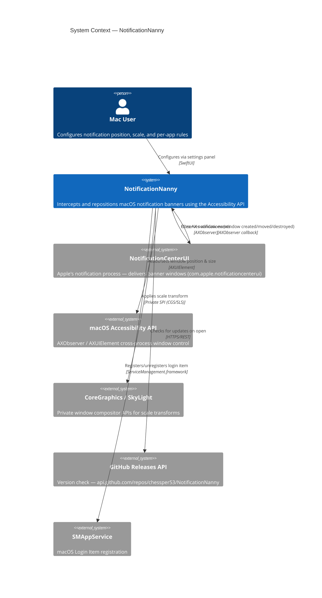
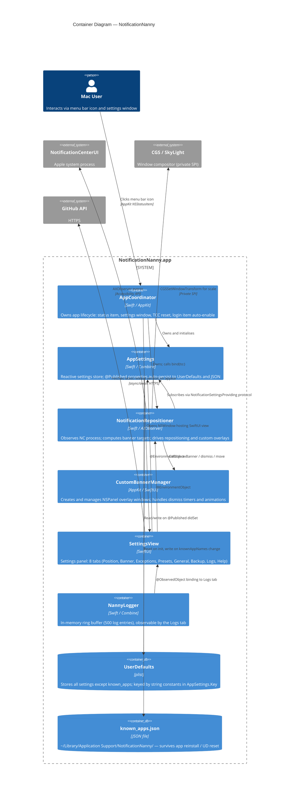
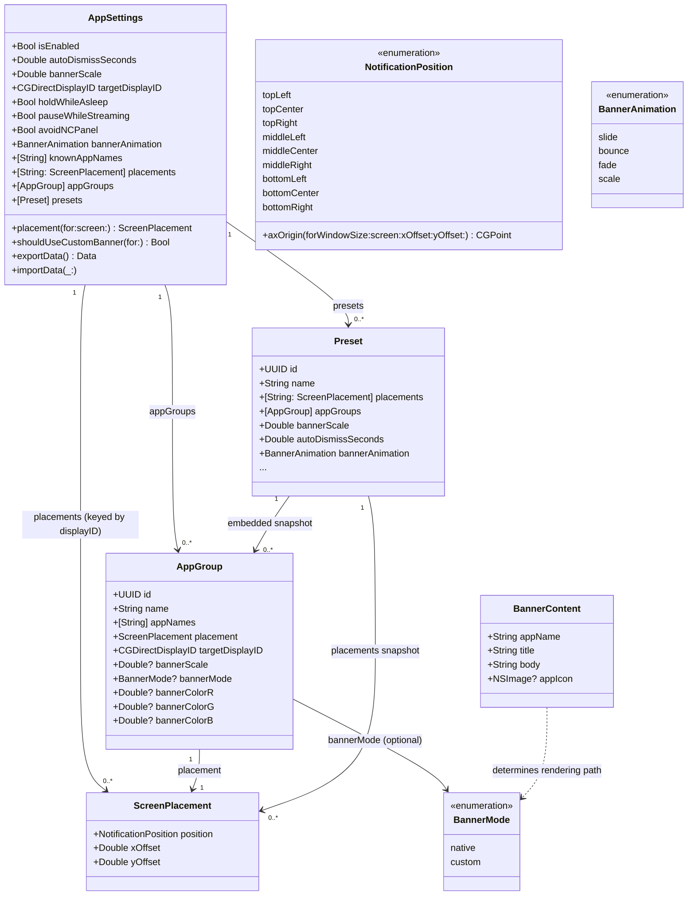
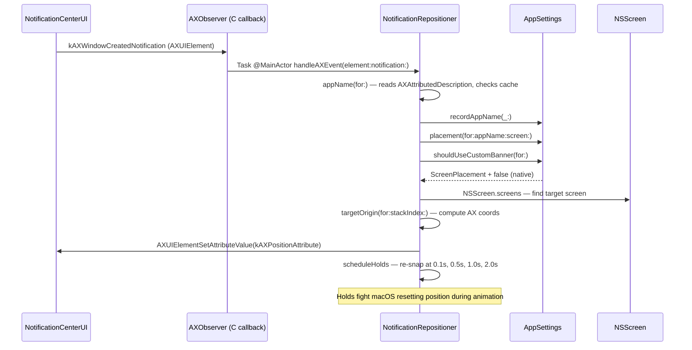
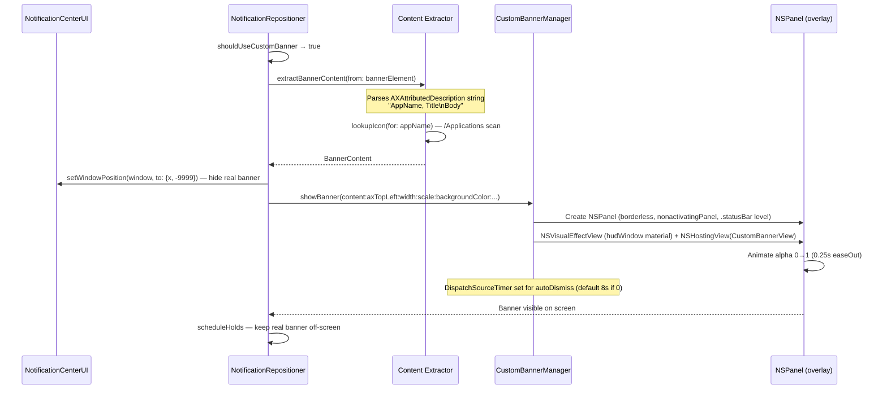
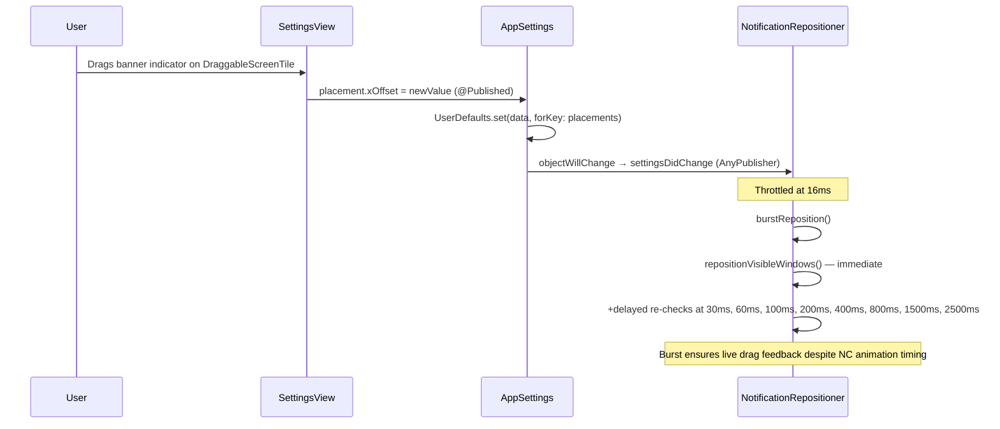
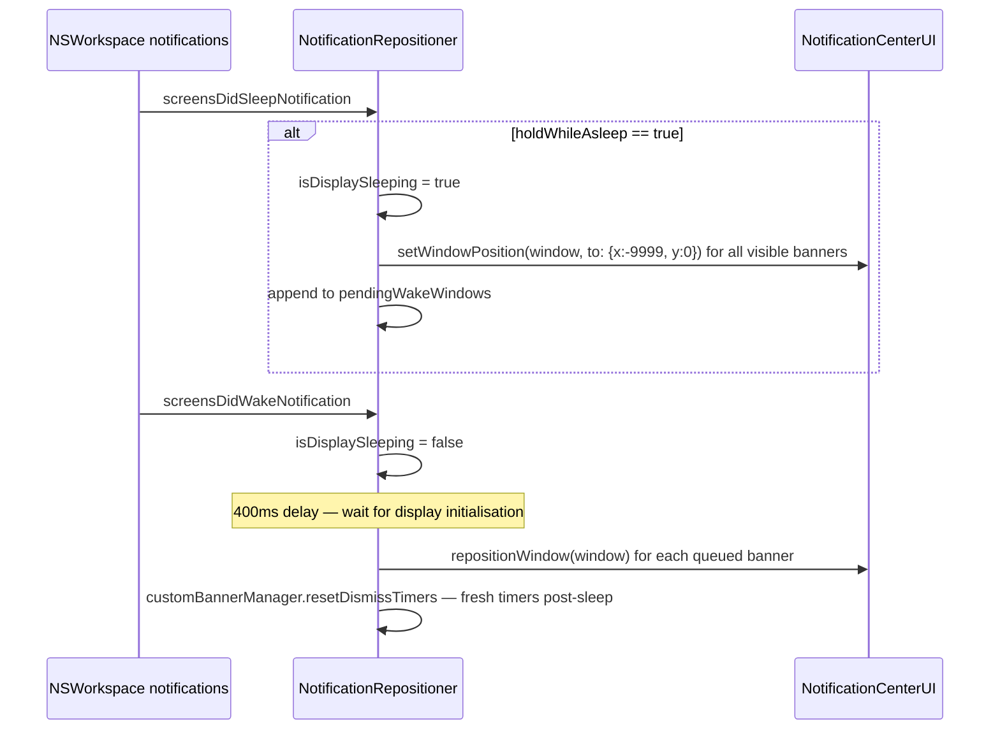
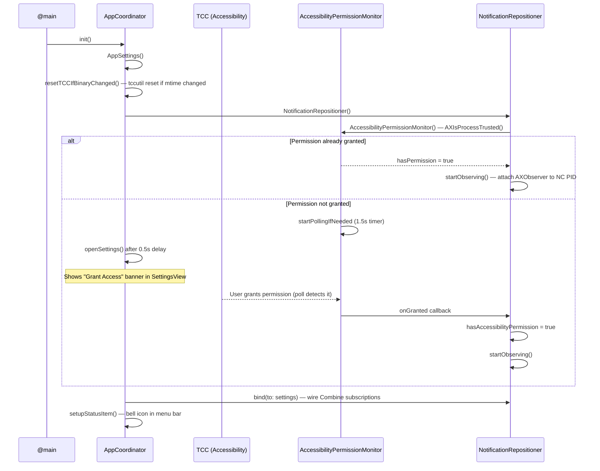

# NotificationNanny — Architecture Documentation

**Project:** notification-nanny  
**Last Updated:** 2026-06-05  
**Language:** English

---

## Document Header

**Version History**

| Version | Date       | Author   | Change Summary                     |
| ------- | ---------- | -------- | ---------------------------------- |
| 1.0     | 2026-06-05 | Claude   | Initial architecture documentation |

**Status:** DRAFT

---

## Quick Reference

### Workspace Structure

```
NotificationNanny (v6.4.0)
├── Sources/NotificationNanny/     — Thin @main executable entry point
├── Sources/NotificationNannyCore/ — All app logic (library target, testable)
└── Tests/NotificationNannyTests/  — Swift Testing unit tests
```

### Key Technologies & Frameworks

- **Language:** Swift 5.9
- **UI Framework:** SwiftUI + AppKit hybrid (`NSHostingController` bridging)
- **Concurrency:** Swift Concurrency (`async/await`), Combine, `@MainActor`
- **Accessibility API:** AXUIElement / AXObserver (cross-process)
- **Private APIs:** `CGSSetWindowTransform`, `CGSSetWindowAlpha`, SkyLight (`SLSSetWindowTransform`), `_AXUIElementGetWindow`
- **Build:** Swift Package Manager (SPM), Makefile, shell scripts
- **Persistence:** `UserDefaults` + JSON file (`~/Library/Application Support/NotificationNanny/`)
- **Login Item:** `SMAppService.mainApp` (macOS 13+)

### Entry Points

- **Main App:** [NotificationNannyApp.swift](Sources/NotificationNanny/NotificationNannyApp.swift)
- **App Coordinator:** [NotificationNannyApp.swift:19](Sources/NotificationNanny/NotificationNannyApp.swift#L19)
- **Core Settings:** [AppSettings.swift](Sources/NotificationNannyCore/AppSettings.swift)
- **Banner Engine:** [NotificationRepositioner.swift](Sources/NotificationNannyCore/NotificationRepositioner.swift)
- **Settings UI:** [SettingsView.swift](Sources/NotificationNannyCore/SettingsView.swift)

### Key Files & Directories

- App Bundle Config: `Resources/Info.plist`
- Entitlements: `Resources/NotificationNanny.entitlements`
- Homebrew Cask: `Casks/notificationnanny.rb`
- Release script: `release.sh`
- Build script: `build-app.sh`

### Main Classes

- `AppCoordinator` — Root lifecycle object; owns settings, repositioner, status bar, settings window
- `AppSettings` — Reactive settings store; persists to UserDefaults + JSON; implements `NotificationSettingsProviding`
- `NotificationRepositioner` — AX observation loop, banner repositioning, scale hammering, sleep/wake handling
- `CustomBannerManager` — Manages `NSPanel`-based custom overlay windows keyed by AX element hash
- `CustomBannerView` — SwiftUI view rendered inside the custom overlay panel
- `NannyLogger` — In-memory ring buffer (500 entries) observable by the UI

---

## 1. System Overview

### Purpose

NotificationNanny is a macOS menu-bar utility (macOS 14+) that intercepts system notification banners delivered by `com.apple.notificationcenterui` and either **repositions** them to a user-configured screen location or **replaces** them entirely with a custom-styled overlay window. It uses the macOS Accessibility API (cross-process) to observe the notification process without sandbox constraints, allowing pixel-perfect placement on any display, per-app grouping rules, banner scaling, tinting, and hold-during-sleep behaviour.

### Architecture Type

**Coordinator + Protocol-oriented Layered Architecture**

```
NotificationNannyApp (@main)
  └── AppCoordinator            ← Lifecycle, status bar, settings window
        ├── AppSettings         ← Reactive settings store (implements NotificationSettingsProviding)
        ├── NotificationRepositioner  ← AX engine, observes NC process
        │     └── CustomBannerManager ← NSPanel overlay lifecycle
        └── LaunchAtLogin       ← SMAppService wrapper
```

- All major objects are `@MainActor` — the entire app is effectively single-threaded on the main actor.
- `NotificationSettingsProviding` protocol decouples the repositioner from the concrete settings store (enables testability).
- SwiftUI views receive dependencies via `@EnvironmentObject` injected by `AppCoordinator`.

---

## 2. C4 Architecture Views

### Level 1: System Context



**Key External Dependencies:**

- **NotificationCenterUI:** The Apple-private process that renders notification banners. NotificationNanny attaches an `AXObserver` to its PID and is notified on `kAXWindowCreatedNotification`, `kAXWindowMovedNotification`, `kAXUIElementDestroyedNotification`, etc.
- **CoreGraphics / SkyLight SPI:** Private `CGSSetWindowTransform` and `SLSSetWindowTransform` (loaded via `dlopen` at runtime) allow applying a 2D affine transform to any window at the compositor level — used for banner scaling.
- **GitHub Releases API:** Polled once per settings-panel open to show an update banner. No auth, unauthenticated rate limit applies.
- **SMAppService:** macOS 13+ login item registration, requires the app to live in `/Applications` for predictable behaviour.

---

### Level 2: Container



---

## 3. Module Structure

### Target Hierarchy

```
NotificationNanny (SPM Package)
├── NotificationNannyCore          (library target — all app logic)
│   ├── AppSettings.swift          Settings store + export/import
│   ├── NotificationRepositioner.swift  AX engine + repositioning
│   ├── CustomOverlay.swift        Custom banner view + manager
│   ├── AppGroup.swift             Per-app group data model
│   ├── ScreenPlacement.swift      Placement model + NSScreen extension
│   ├── NotificationPosition.swift 9-anchor position enum + geometry
│   ├── Preset.swift               Named configuration snapshot
│   ├── NotificationSettingsProviding.swift  Protocol interface
│   ├── AccessibilityPermissionMonitor.swift TCC polling
│   ├── LaunchAtLogin.swift        SMAppService wrapper
│   ├── UpdateChecker.swift        GitHub Releases version check
│   ├── NannyLogger.swift          In-memory log ring buffer
│   ├── NotificationProbe.swift    Diagnostic window enumeration
│   ├── MenuBarContent.swift       (menu bar population, if present)
│   └── PositionTile.swift         DraggableScreenTile + TestNotification
│
├── NotificationNanny              (executable target — entry point only)
│   └── NotificationNannyApp.swift @main + AppCoordinator
│
└── NotificationNannyTests         (test target)
    ├── AppGroupTests.swift
    ├── AppSettingsPersistenceTests.swift
    ├── AppSettingsTests.swift
    ├── NotificationPositionGeometryTests.swift
    ├── NotificationPositionTests.swift
    ├── PresetTests.swift
    └── ScreenPlacementTests.swift
```

### Target Responsibilities

#### NotificationNannyCore (library)

**Purpose:** Contains all business logic so it can be `@testable import`-ed by the test target without instantiating the app process.

**Key Components:**
- `AppSettings` — `@MainActor` `ObservableObject`; the root settings store. Exposes `@Published` properties for every setting; each `didSet` fires `defaults.set(...)` for instant persistence. Also exposes `NotificationSettingsProviding` conformance so the repositioner can subscribe without importing concrete types.
- `NotificationRepositioner` — The heart of the app. Attaches an `AXObserver` to the NC process, receives window lifecycle events, computes target positions, and either moves the real NC window or creates a custom `NSPanel` overlay.
- `CustomBannerManager` / `CustomBannerView` / `BannerAnimationController` — Full custom overlay pipeline: `NSPanel` + `NSVisualEffectView` host + SwiftUI `NSHostingView`. Keyed by `CFHashCode(axElement)`.
- `NotificationSettingsProviding` — Protocol used by `NotificationRepositioner` so tests can inject a mock settings object.

#### NotificationNanny (executable)

**Purpose:** Thin `@main` entry point. Contains `NotificationNannyApp` (the SwiftUI `App`) and `AppCoordinator` (root lifecycle object). The `App` body is intentionally a `Settings { EmptyView() }` scene — the real UI is an `NSWindow` managed imperatively by `AppCoordinator` because `LSUIElement` apps have no automatic menu bar.

**Key Components:**
- `AppCoordinator` — Constructs `AppSettings`, `LaunchAtLogin`, `NotificationRepositioner`, sets up `NSStatusItem`, opens `SettingsView` in an `NSWindow`, handles TCC reset on binary change.

---

## 4. Data Model

### 4.1 Key Types

#### AppSettings (root store)

- **Persistence:** `UserDefaults.standard` for all fields except `knownAppNames` which is additionally written to `~/Library/Application Support/NotificationNanny/known_apps.json`.
- **Lifecycle:** Instantiated once by `AppCoordinator`; lives for the app lifetime.
- **Export format:** `SettingsExport` struct (Codable JSON) — excludes `knownApps` (device-specific) and `isEnabled`/`holdWhileAsleep` (not currently in export schema).

#### AppGroup

- **Purpose:** Per-app rule set. One group contains N app names and overrides: `ScreenPlacement`, `targetDisplayID`, `bannerScale?`, `bannerMode?`, `bannerColorRGB?`.
- **Nil-means-inherit pattern:** `bannerScale`, `bannerMode`, and color components are all `Optional` — `nil` means "inherit global default", allowing groups to opt into only specific overrides.
- **Relationships:** `AppSettings.appGroups: [AppGroup]` (1:N); a given `appName` string belongs to at most one group (enforced by `addApp(_:toGroup:)`).

#### ScreenPlacement

- **Purpose:** Where on a specific screen the banner should appear.
- **Fields:** `position: NotificationPosition` (9-anchor grid) + `xOffset: Double` + `yOffset: Double` (pixel fine-tune from anchor).
- **Keying:** Stored in `AppSettings.placements: [String: ScreenPlacement]` keyed by `String(screen.displayID)`.

#### Preset

- **Purpose:** A full named snapshot of settings. Applied atomically — overwrites `placements`, `targetDisplayID`, `autoDismissSeconds`, `bannerScale`, `holdWhileAsleep`, `pauseWhileStreaming`, `appGroups`, and `bannerAnimation` all at once.
- **Limit:** 5 presets (enforced in UI).

#### BannerContent (transient)

- **Purpose:** Extracted notification content for rendering the custom overlay. Not persisted.
- **Extraction:** Parsed from the `AXAttributedDescription` attribute of the NC banner element — comma-separated format `"AppName, Title\nBody"`.

### 4.2 Data Model Diagram



---

## 5. Business Logic & Workflows

### 5.1 Banner Rendering Decision Tree

When a banner arrives, `NotificationRepositioner` decides the rendering path:

```
Banner AX event received
        │
        ▼
isEnabled? ──No──► ignore
        │
       Yes
        ▼
pauseWhileStreaming && isCapturing()? ──Yes──► ignore
        │
       No
        ▼
Resolve app name from AXAttributedDescription
        │
        ▼
Lookup AppGroup for app name
        │
        ▼
shouldUseCustomBanner?
 ┌──────┴──────┐
Yes           No
 │             │
 ▼             ▼
Extract       Move NC window
BannerContent  to target position
 │
 ▼
Show NSPanel
custom overlay,
move NC window
off-screen (-9999)
```

### 5.2 Key Workflows

#### Workflow 1: Banner Repositioning (native path)



**Key Points:**
- AX events arrive on the main run loop via `CFRunLoopAddSource`.
- `kAXWindowMovedNotification` is filtered: if drift from last self-set position is ≤4px, it is treated as a self-induced move and ignored to prevent feedback loops.
- `scheduleHolds` fires 4 delayed re-snaps because the NC process resets banner positions during its slide-in animation.
- Large windows (>700px wide or >400px tall) are handled specially on macOS 26+ where NC wraps banners in an overlay window — the code digs into the AX tree to find the actual banner child element.

#### Workflow 2: Custom Overlay Path



#### Workflow 3: Settings Change → Live Reposition



#### Workflow 4: Display Sleep / Wake



### 5.3 Scale Architecture

Banner scaling is currently experimental. `NotificationRepositioner.applyScale` tries **four approaches in sequence** every time a banner is repositioned:

| Approach | Method | Target | Status |
|----------|--------|--------|--------|
| 1a | `AXUIElementSetAttributeValue(kAXSizeAttribute)` | NC overlay window | Rarely works (size not settable cross-process) |
| 1b | `AXUIElementSetAttributeValue(kAXSizeAttribute)` | Banner child element | Rarely works |
| 2a/b | `CGSSetWindowAlpha` / `SLSSetWindowAlpha` | Window compositor | Alpha works; used as a sanity check |
| 2c/d | `CGSSetWindowTransform` / `SLSSetWindowTransform` | Window compositor | Visual scale via affine transform — main technique |

When scale ≠ 1.0 AND the NC window is an overlay type, a 60fps `DispatchSourceTimer` (the "scale hammer") continuously re-writes `kAXSizeAttribute` on the banner child element to fight the NC layout pass, which resets sizes each frame.

**In practice:** When `shouldUseCustomBanner` is true (scale ≠ 1.0 or tint active), the app suppresses the NC banner entirely and renders its own. This is the reliable path. The CGS transform approach is the fallback for the native banner case.

---

## 6. Permission & Startup Sequence



---

## 7. Technology Stack

### Core

| Layer | Technology | Details |
|-------|-----------|---------|
| Language | Swift 5.9 | Strict concurrency (`@MainActor`, `nonisolated(unsafe)`) |
| UI | SwiftUI + AppKit | SwiftUI for settings panel; AppKit (`NSPanel`, `NSStatusItem`, `NSWindow`) for system-level windows |
| Reactivity | Combine | `@Published` + `AnyPublisher`; `objectWillChange` piped through `throttle` |
| Concurrency | Swift Concurrency | `Task { @MainActor }` for bridging C callbacks; `async/await` for network |
| Accessibility | AXObserver / AXUIElement | Cross-process; requires Accessibility permission in TCC |
| Private SPI | CoreGraphics (CGS), SkyLight | `CGSSetWindowTransform`, `SLSSetWindowTransform` (loaded via `dlopen` at runtime) |
| Persistence | UserDefaults + FileManager | Codable JSON encoded into UserDefaults; `known_apps.json` on disk |
| Login Item | SMAppService | macOS 13+ `SMAppService.mainApp.register()` |
| Notifications | UNUserNotificationCenter | Used only for test notification display delegate (forces `.banner` presentation) |
| Update Check | URLSession | Single async request to GitHub Releases API |

### Testing

- **Framework:** Swift Testing (`@Test`, `#expect`)
- **Injection:** `AppSettings.init(defaults:knownAppsFileURL:)` accepts injected `UserDefaults` and file URL for isolation
- **Coverage:** Core domain types (geometry, placement, group logic, persistence)
- **Not tested:** UI layer, AX callbacks, private API calls

### Build & Distribution

- **Build system:** SPM (`Package.swift`) for development/testing; custom `build-app.sh` for release bundle assembly
- **Distribution:** Homebrew Cask (`chessper53/notificationnanny`)
- **CI:** GitHub Actions (`.github/workflows/ci.yml`, `release.yml`, `auto-release.yml`)
- **Version source of truth:** `VERSION` file (e.g. `6.4.0`), injected into `Info.plist` at build time

---

## 8. Key Design Patterns

### 1. Protocol-Based Dependency Injection (`NotificationSettingsProviding`)

- **Purpose:** Decouples `NotificationRepositioner` from the concrete `AppSettings` class; enables mock injection in tests.
- **Implementation:** `NotificationSettingsProviding` protocol lists all properties and methods the repositioner reads. `AppSettings` conforms in an `extension`.
- **Usage:** `NotificationRepositioner.bind(to: any NotificationSettingsProviding)`.

### 2. Two-Pass Banner Stacking

- **Purpose:** When multiple banners exist, they must stack in the correct direction (upward for bottom-anchored positions, downward for top-anchored) without interfering with each other.
- **Implementation:** `repositionVisibleWindows` does a first pass to resolve each banner's `RepositionTarget` at `stackIndex=0`, then groups by `(displayID, position)` anchor and assigns a monotonically increasing `stackIndex` per group. Each banner's Y is offset by `stackIndex × (bannerHeight + 8)`.

### 3. Drift Guard (Self-Move Filter)

- **Purpose:** Prevents infinite loops — when the app moves a banner, NC fires a `kAXWindowMovedNotification`, which would trigger a re-reposition, which triggers another move event, etc.
- **Implementation:** `lastSelfSetPosition` is updated after every `setWindowPosition` call. On `kAXWindowMovedNotification`, the Euclidean distance between the current position and `lastSelfSetPosition` is computed; if it is ≤4px, the event is treated as self-induced and ignored.

### 4. Generation Counter (Animation Guard)

- **Purpose:** Prevents stale async closures from repositioning a banner that has already been dismissed or replaced.
- **Implementation:** `animationGeneration` is an integer incremented before every reposition. Each scheduled closure (`scheduleHolds`, `scheduleAutoDismiss`) captures the generation at scheduling time and checks it before executing; if the stored value changed, the closure is a no-op.

### 5. CFHashCode Keying for Custom Banners

- **Purpose:** Map a live `AXUIElement` to its corresponding `NSPanel` overlay without retaining the element.
- **Implementation:** `CFHash(axElement)` is used as the dictionary key in `CustomBannerManager.active`. This avoids strong references across process boundaries while providing a stable identity for the lifetime of a given banner window.

---

## 9. Testing Strategy

### Test Organisation

- **Location:** `Tests/NotificationNannyTests/`
- **Framework:** Swift Testing (`@Test`, `#expect`)
- **Isolation:** `AppSettings` is initialised with `UserDefaults(suiteName: UUID().uuidString)` to avoid polluting the real defaults.

### Test Coverage

| File | What is tested |
|------|---------------|
| `AppSettingsTests.swift` | Default values, toggle persistence, `isEnabled` logic |
| `AppSettingsPersistenceTests.swift` | Round-trip encode/decode for placements, groups, presets |
| `AppGroupTests.swift` | Group membership, add/remove/rename, nil-inherit logic |
| `NotificationPositionTests.swift` | `axOrigin` coordinate computation per anchor, multi-screen |
| `NotificationPositionGeometryTests.swift` | Edge-case geometry (offset clamping, screen boundaries) |
| `PresetTests.swift` | Save/apply/delete preset, field preservation |
| `ScreenPlacementTests.swift` | `ScreenPlacement.default`, Codable round-trip |

**Not covered (integration/manual):**
- AX observation loop (requires live system process)
- `CustomBannerManager` window creation (requires a running display)
- Private SPI calls

---

## 10. Glossary

| Term | Definition |
|------|-----------|
| AX / Accessibility API | macOS Accessibility framework — `AXUIElement`, `AXObserver`. Allows cross-process inspection and control of UI elements. Requires Accessibility permission in TCC. |
| TCC | Transparency, Consent, and Control — the macOS privacy permission database. `tccutil reset Accessibility <bundleID>` clears the app's entry. |
| NC / NotificationCenterUI | `com.apple.notificationcenterui` — the Apple system process responsible for displaying notification banners. |
| Banner | A transient notification window shown by NC (the rectangular toast that slides in from the corner). |
| CGS / SkyLight | CoreGraphics Server (private) and SkyLight.framework (private) — the window compositor layer below Quartz. Provides `CGSSetWindowTransform` for affine scaling. |
| Scale Hammer | The 60fps `DispatchSourceTimer` that repeatedly writes `kAXSizeAttribute` on the NC banner element, fighting the NC layout pass which resets sizes at the same rate. |
| Drift Guard | The ≤4px Euclidean distance check on `kAXWindowMovedNotification` that prevents self-induced feedback loops. |
| Generation Counter | `animationGeneration` integer used to invalidate stale async closures after a new reposition begins. |
| Overlay window | An `NSPanel` with `.borderless` + `.nonactivatingPanel` at `.statusBar` window level, used as the custom banner replacement. |
| AppGroup | A named collection of app names that share position, scale, banner mode, and tint overrides. |
| Preset | A named snapshot of the full settings state (position, scale, groups, behaviour toggles) that can be recalled in one tap. |
| ScreenPlacement | The combination of a 9-anchor `NotificationPosition` and pixel offsets (`xOffset`, `yOffset`), stored per physical display. |
| LSUIElement | `Info.plist` key that hides the app from the Dock and the App Switcher, making it a pure menu-bar app. |

---

## 11. Architectural Improvement Areas

The following issues range from minor code quality concerns to significant structural problems that limit maintainability, testability, and reliability.

---

### P1 — Critical / High Impact

#### 1. `NotificationRepositioner` is a God Class (~1050 lines)

**Problem:** A single class handles AX observer lifecycle, event routing, app name extraction, multi-screen geometry, sleep/wake management, scale hammering, custom banner orchestration, test-mode state, and the process-finder fallback. This makes it nearly impossible to unit-test any individual concern.

**Suggested split:**
```
NotificationRepositioner (orchestrator only)
├── AXObserverController        — attach/detach observer, process finding
├── BannerGeometryEngine        — targetOrigin, stacking, screen resolution
├── AppNameResolver             — AX attribute parsing, cache, recording
└── ScaleController             — hammering timer, CGS/SLS transform attempts
```

#### 2. Scale Implementation is a Gauntlet Without Feedback

**Problem:** `applyScale` tries four approaches on every banner, logging results but never persisting which approach worked. On macOS 26, the correct approach may differ from macOS 14; the code has no mechanism to adapt. This generates noise in the log and wastes CPU probing dead-end API calls.

**Suggestion:** Probe at startup (or first banner appearance) with a simple canary banner. Cache `ScaleApproach.preferredForCurrentOS` in UserDefaults. Fall back only if the preferred approach returns a non-zero error code.

#### 3. `SettingsView` is 1600+ Lines in One File

**Problem:** All eight settings tabs, all helper views, all diagnostic logic, and all backup/import logic live in a single file. This makes navigation and code review difficult, and any `@State` or `@ObservedObject` change invalidates the entire view body.

**Suggestion:** Split into per-tab views (`PositionTabView`, `BannerTabView`, `ExceptionsTabView`, etc.) in their own files. Each tab can own its own `@State`; `SettingsView` becomes a shell with a sidebar and a `switch` that routes to child views.

---

### P2 — Medium Impact / Architecture

#### 4. `Preset` Embeds a Full Deep Copy of `[AppGroup]`

**Problem:** `Preset` stores a complete snapshot of `appGroups`. Applying a preset replaces the live array entirely, which means there is no diff — any group the user modified after saving the preset is silently overwritten. There is also no schema migration path if `AppGroup` gains new fields.

**Suggestion:** Introduce a `PresetV2` that stores a diff against a "base" or uses a separate `presetsIncludeGroups: Bool` flag the user can opt in to. At minimum, the export schema should be versioned.

#### 5. `AppGroup` Color Stored as Three Raw `Double?` Components

**Problem:** `AppGroup` stores banner color as `bannerColorR/G/B: Double?`. This is duplicated from `AppSettings` (which also has `bannerColorR/G/B`), is error-prone (three separate optionals that must agree), and bypasses Swift's type system.

**Suggestion:** Extract a `BannerTint: Codable` value type (`r, g, b: Double`) and make both `AppSettings` and `AppGroup` use `var bannerTint: BannerTint?`. This reduces the three-optional anti-pattern to a single optional value.

#### 6. `osascript` for Test Notifications

**Problem:** `TestNotification.send()` spawns `/usr/bin/osascript` with a shell script to fire a notification. This is fragile (AppleScript is not guaranteed available), verbose, and unnecessary.

**Suggestion:** Use `UNUserNotificationCenter.current().add(UNNotificationRequest(...))` directly. The app already holds a `UNUserNotificationCenterDelegate` and has the infrastructure to force banner presentation.

#### 7. `pgrep` Subprocess as NC Process Fallback

**Problem:** `findNotificationProcessPid` falls back to spawning `/usr/bin/pgrep usernotificationsd` as a subprocess. This is fragile, slow, and incorrect — `usernotificationsd` is a background daemon, not the process that draws banners. On macOS 26 the banner process identity may differ entirely.

**Suggestion:** Use `NSWorkspace.shared.runningApplications` exclusively (already the primary path), and add a CGWindowList scan to find windows owned by processes with "notification" in the bundle ID as the fallback — no subprocess needed.

---

### P3 — Lower Impact / Code Quality

#### 8. `windowAppNameCache` Never Expires

**Problem:** `windowAppNameCache: [CFHashCode: String]` is cleared only when the observer tears down. `CFHash` values can theoretically be reused across banner lifetimes (same hash, different element), leading to incorrect app-name assignments for new banners.

**Suggestion:** Store `(cfHashCode, weakElement)` pairs and invalidate the cache entry on `kAXUIElementDestroyedNotification`. Alternatively, cap cache size and use an LRU eviction.

#### 9. `@Published var appGroups` Triggers Full Array Republish

**Problem:** Because `appGroups` is a `[AppGroup]` value type array, any mutation (changing a group's scale, renaming a group, toggling a single checkbox) republishes the entire array. This causes `SettingsView` to re-render all group-related UI even when only one group changed.

**Suggestion:** Consider a `@Published var appGroupsByID: [UUID: AppGroup]` lookup alongside the ordered array, or use `Identifiable`-aware diffing via `ForEach` bindings on `$settings.appGroups` to limit re-renders.

#### 10. Private SPI Declarations Scattered in the Repositioner

**Problem:** The `@_silgen_name` declarations and `dlopen`/`dlsym` loading for CGS and SkyLight are declared at file scope inside `NotificationRepositioner.swift`. They are difficult to find, test, or replace.

**Suggestion:** Extract into a dedicated `PrivateWindowAPI.swift` file that exposes a clean Swift interface (e.g. `PrivateWindowAPI.setTransform(_:on:)`) and isolates the unsafe symbol declarations.

#### 11. Icon Lookup Hardcodes Four Directory Paths

**Problem:** `lookupIcon(for:)` scans `/Applications`, `~/Applications`, `/System/Applications`, and `/System/Applications/Utilities` with hardcoded strings. Apps installed elsewhere (e.g. in `/opt/homebrew/Caskroom`, developer builds in `~/Developer`) are missed, resulting in fallback bell icons.

**Suggestion:** Use `NSWorkspace.shared.urlForApplication(withBundleIdentifier:)` combined with the running application list as primary lookups. The directory scan can remain as a last resort.

#### 12. `NannyLogger` is a Global Singleton with No Injection Path

**Problem:** `NannyLogger.shared` is used directly throughout the codebase. There is no way to redirect log output in tests or provide a custom sink.

**Suggestion:** Accept `NannyLogger` as an injected dependency in `NotificationRepositioner.init(logger:)`. Keep the shared singleton as the default for production use.

---

## 12. References & Related Documents

### Internal

- [README.md](README.md) — User-facing feature documentation and installation guide
- [VERSION](VERSION) — Single source of truth for the version string
- [Makefile](Makefile) — Common development commands
- [build-app.sh](build-app.sh) — Release bundle assembly script
- [.github/workflows/ci.yml](.github/workflows/ci.yml) — CI configuration

### External

- [Apple Accessibility API Reference](https://developer.apple.com/documentation/accessibility/axuielement)
- [SMAppService Documentation](https://developer.apple.com/documentation/servicemanagement/smappservice)
- [GitHub Issues](https://github.com/chessper53/NotificationNanny/issues) — Bug tracker and feature requests

---

*Architecture document generated from source on 2026-06-05 (v6.4.0)*
