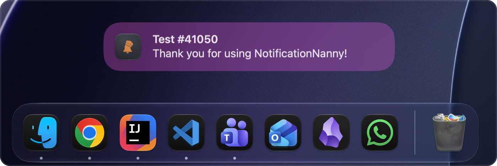

<p align="center">
  
</p>

<h1 align="center">NotificationNanny</h1>

<p align="center">
  <b>Don't let macOS decide where your notifications go.</b><br />
  Position, scale, tint, and animate notification banners, globally or per app.
</p>

<p align="center">
  <a href="https://github.com/chessper53/NotificationNanny/releases/latest"><b>Download for macOS</b></a> ·
  <a href="https://chessper53.github.io/NotificationNanny/">Website</a> ·
  <a href="docs/CHANGELOG.md">Changelog</a> ·
  <a href="https://github.com/chessper53/NotificationNanny/issues">Report an issue</a>
</p>

<p align="center">
  
  
  
</p>

<br />

<p align="center">
  
  <br />
  <sub>A tinted banner, moved from the top right corner to sit just above the Dock.</sub>
</p>

<br />

NotificationNanny is a menu bar app for macOS 14 Sonoma and later, tested through macOS 27. macOS puts every notification banner in the same corner and gives you no way to move it. NotificationNanny does.

- **Any corner, any display.** Nine anchor points, with separate settings for each screen.
- **Your look.** Scale banners from 50% to 250%, tint them, or swap in a custom styled banner.
- **Rules per app.** Named groups give specific apps their own position, display, scale, and tint.

## Install

With Homebrew:

```sh
brew tap chessper53/notificationnanny https://github.com/chessper53/NotificationNanny
brew install --cask notificationnanny
```

Then click the bell icon in your menu bar and grant Accessibility permission. If you installed with Homebrew, updates are one click from the settings panel.

Or install manually:

1. [Download the latest zip](https://github.com/chessper53/NotificationNanny/releases/latest) and open it.
2. Drag `NotificationNanny.app` into Applications, then launch it.
3. Click the bell icon in your menu bar and grant Accessibility permission.

You will need to grant Accessibility permission again after every update. macOS ties that permission to the exact build it was granted to, so a new version arrives as an unrecognised app.

## What it does

- Nine anchor points on any display, with independent settings per screen
- Scale banners from 50% to 250%, tint the background or text, or replace the system banner with a custom styled one
- Give specific apps their own rules, using named groups with their own position, display, scale, and tint
- Choose how banners animate in: system default, slide, bounce, fade, or scale
- Hold banners until your display wakes up, so nothing disappears while you are away
- Dismiss banners automatically on a timer from 1 to 300 seconds, or leave them until you are ready

## Issues and feature requests

I have a full time job, so responses may take a little while, but nothing goes unread. Found a bug or have an idea? [Open an issue here](https://github.com/chessper53/NotificationNanny/issues).

## Privacy

No data is collected, transmitted, or stored outside your device. The Accessibility permission is used solely to observe and control notification windows on your local machine.

## How it works

NotificationNanny uses the macOS Accessibility API to observe the notification center process. When a banner appears it repositions or replaces it according to your rules. For scaled, tinted, or custom banners it intercepts the notification, moves the system banner off screen, and shows its own window matching the macOS banner style. This relies on private internals, so Apple can change the behavior in any OS update. The app sandbox is disabled because cross process Accessibility access requires it.

For contributors, [docs/ARCHITECTURE.md](docs/ARCHITECTURE.md) covers the internals.

## License

Released under the [MIT License](LICENSE).
