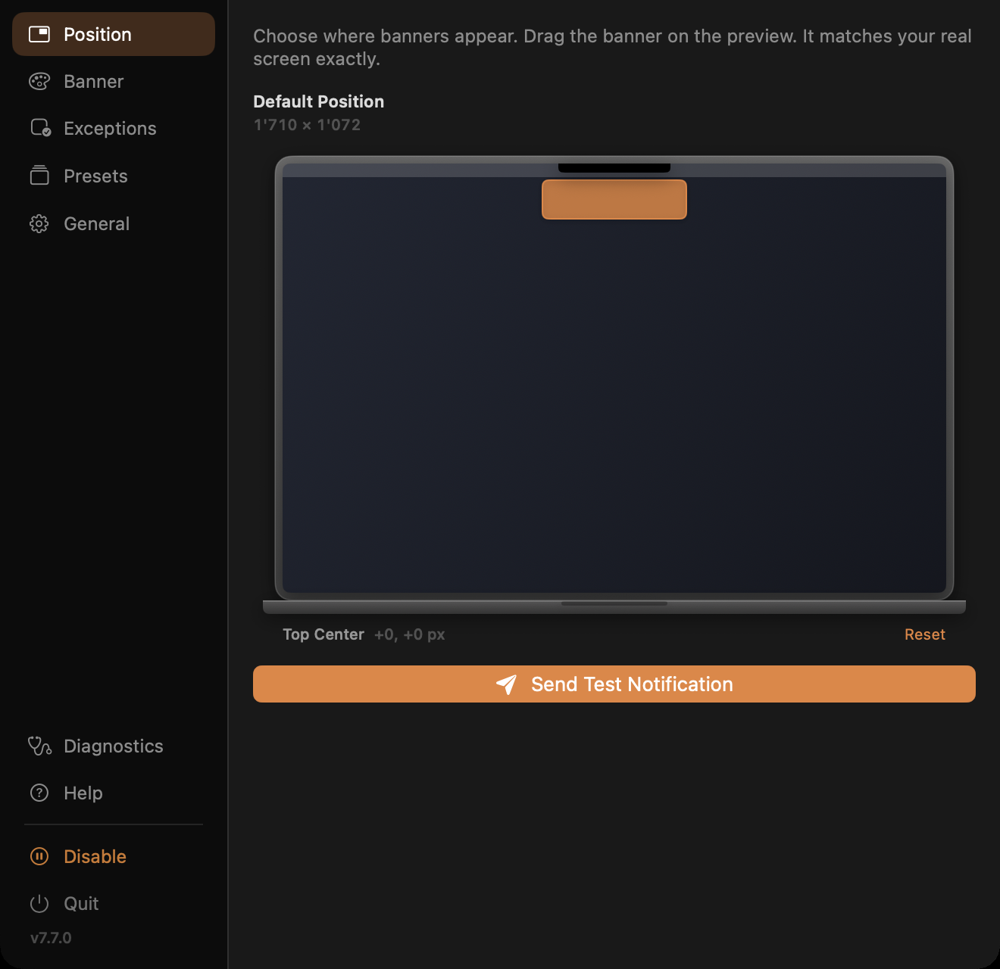

# NotificationNanny

Position, scale, tint, and animate your notification banners globally or per app, on whichever display you want.

  

<!--
  Demo video. To swap the still below for the clip:
  drag the .mp4 into any GitHub issue comment, copy the
  https://github.com/user-attachments/... URL it returns, and paste it on its
  own line here. GitHub renders that URL as an inline player. Keep the 
  as-is underneath, so the page still reads where video will not load.
-->
<p align="center">
  
</p>

## Installation

**Homebrew**

```sh
brew tap chessper53/notificationnanny https://github.com/chessper53/NotificationNanny
brew install --cask notificationnanny
```

**Direct download**

Grab the latest zip from the [Releases page](https://github.com/chessper53/NotificationNanny/releases/latest) and drag `NotificationNanny.app` into your Applications folder.

Either way, click the bell icon in your menu bar afterwards and grant Accessibility permission to get started. If you installed with Homebrew, updates are one click from the settings panel.

You will need to grant Accessibility permission again after every update. macOS ties that permission to the exact build it was granted to, so a new version arrives as an unrecognised app.

## What it does

macOS gives you one place for notification banners and no way to change it. NotificationNanny takes that control back.

- Nine anchor points on any display, with independent settings per screen
- Scale banners from 50% to 250%, tint the background or text, or replace the system banner with a custom styled one
- Give specific apps their own rules, using named groups with their own position, display, scale, and tint
- Choose how banners animate in: system default, slide, bounce, fade, or scale
- Hold banners until your display wakes up, so nothing disappears while you are away
- Dismiss banners automatically on a timer from 1 to 300 seconds, or leave them until you are ready

## Issues and feature requests

I have a full time job, so responses may take a little while, but nothing goes unread. Found a bug or have an idea? [Open an issue here](https://github.com/chessper53/NotificationNanny/issues).

## Privacy

No data is collected, transmitted, or stored outside your device. The Accessibility permission is used solely to observe and control notification windows on your local machine.

## How it works

NotificationNanny uses the macOS Accessibility API to observe the notification center process. When a banner appears it repositions or replaces it according to your rules. For scaled, tinted, or custom banners it intercepts the notification, moves the system banner off screen, and shows its own window matching the macOS banner style. This relies on private internals, so Apple can change the behavior in any OS update. The app sandbox is disabled because cross process Accessibility access requires it.

Supports macOS 14 Sonoma and later, tested through macOS 27.

## License

Released under the [MIT License](LICENSE).
