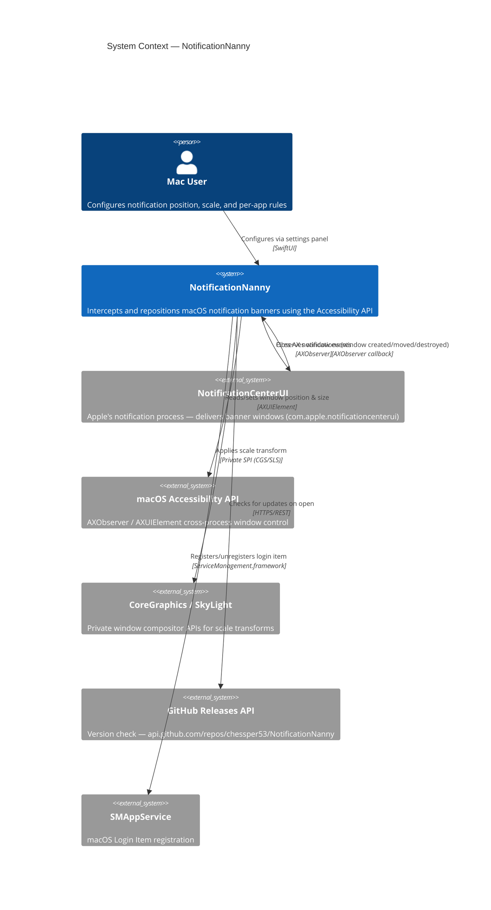
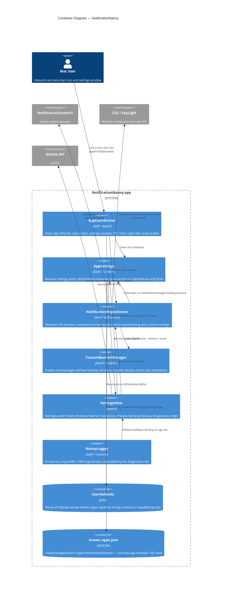
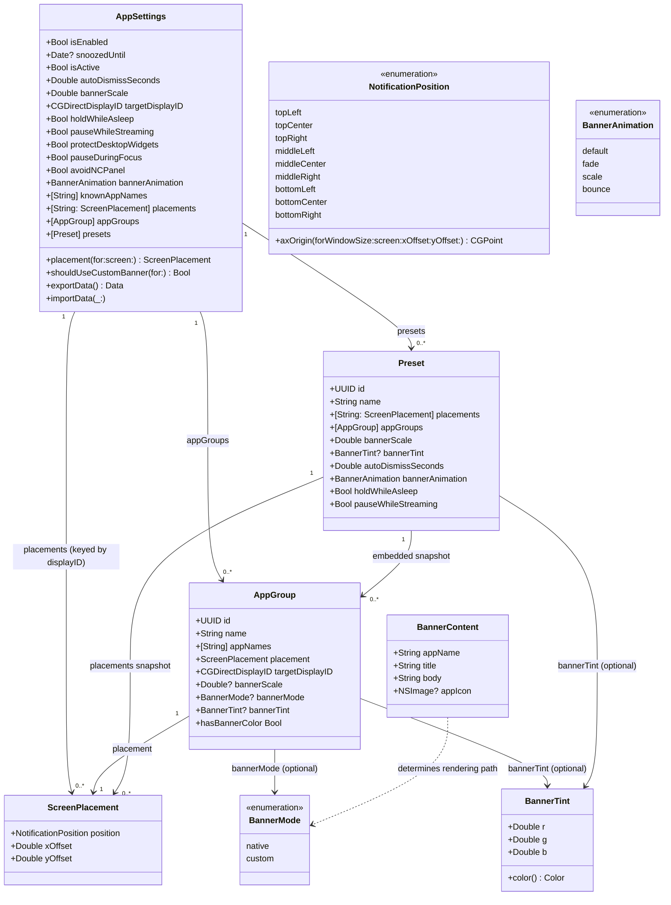
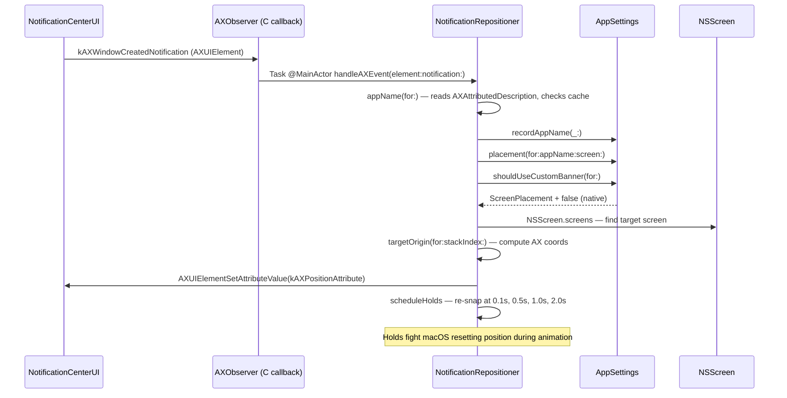
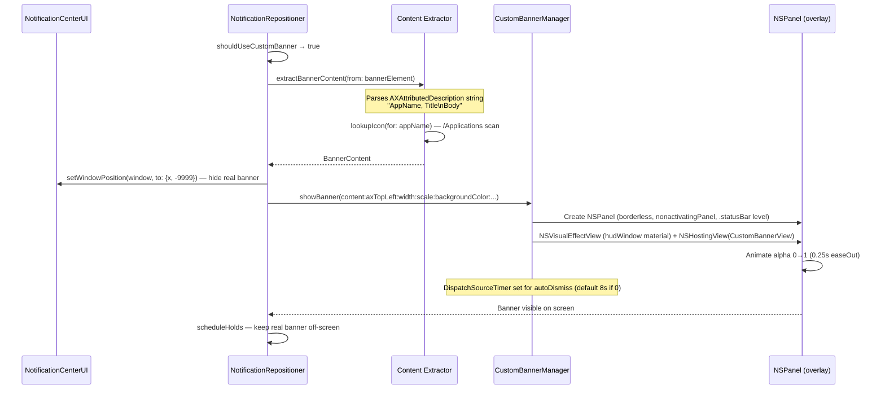
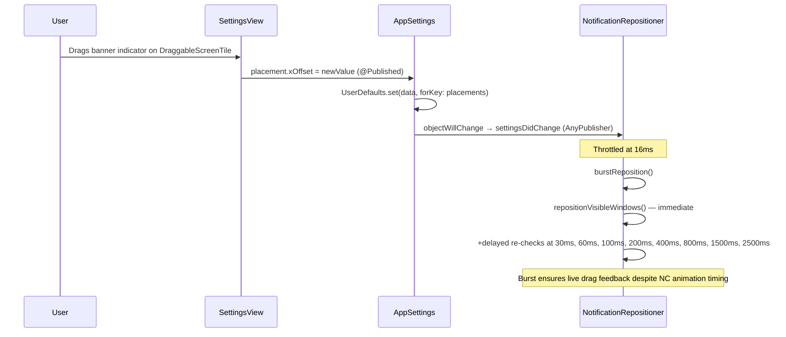
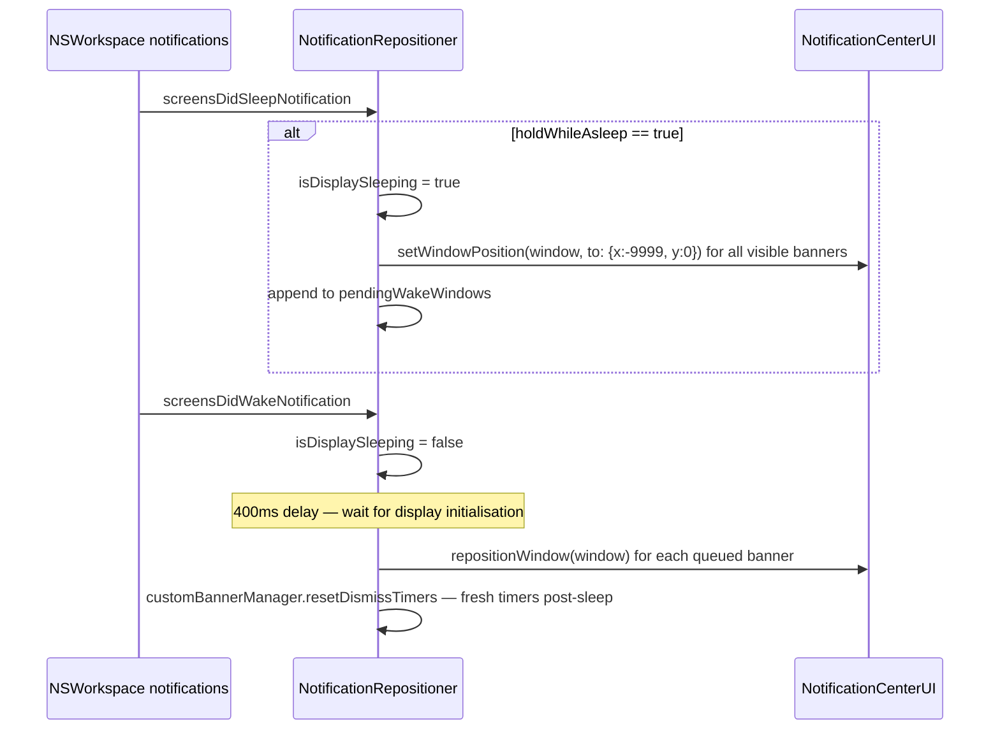
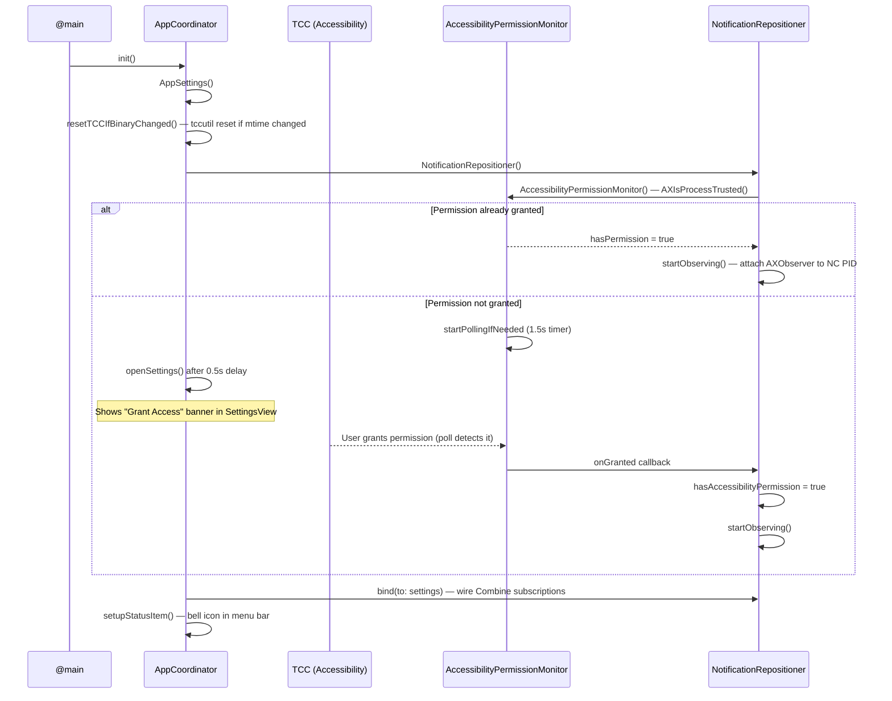

# NotificationNanny — Architecture Documentation

**Project:** notification-nanny  
**Last Updated:** 2026-06-18  
**Language:** English

---

## Document Header

**Version History**

| Version | Date       | Author   | Change Summary                                                          |
| ------- | ---------- | -------- | ----------------------------------------------------------------------- |
| 1.0     | 2026-06-05 | Claude   | Initial architecture documentation                                      |
| 1.1     | 2026-06-05 | Claude   | Post-refactor update: BannerTint, AppNameResolver, SettingsView split, PrivateWindowAPI, animation auto-activation |
| 1.2     | 2026-06-09 | Claude   | Added InstallSource, HomebrewUpdater; in-app Homebrew auto-updater with live output streaming |
| 1.3     | 2026-06-10 | Claude   | Bug fixes: screen reconfiguration handler, scheduleAutoDismiss fight-back, offScreenOrigin multi-screen; dead code removal |
| 1.4     | 2026-06-17 | Claude   | Back-to-back race fixes (per-window generation, test-banner identity, readiness gate, overlay content refresh, width clamp); title/body extraction via AXStaticText; per-group animation; Diagnostics tab + bug-report auto-attach |
| 1.5     | 2026-06-17 | Claude   | AX primitives extracted to `AXUIElement` extension (`AXSupport.swift`); Snooze / pause-for-N-minutes feature; export schema versioning |
| 1.6     | 2026-06-18 | Claude   | Desktop-widget protection (`protectDesktopWidgets`); pause-during-Focus (`FocusModeMonitor`, `pauseDuringFocus`); `LogEntryRow` view extraction; export schema carries the new toggles; CHANGELOG.md added |

**Status:** CURRENT

---

## Quick Reference

### Workspace Structure

```
NotificationNanny (v7.5.0)
├── Sources/NotificationNanny/     — Thin @main executable entry point
├── Sources/NotificationNannyCore/ — All app logic (library target, testable)
└── Tests/NotificationNannyTests/  — Swift Testing unit tests
```

### Key Technologies & Frameworks

- **Language:** Swift 5.9
- **UI Framework:** SwiftUI + AppKit hybrid (`NSHostingController` bridging)
- **Concurrency:** Swift Concurrency (`async/await`), Combine, `@MainActor`
- **Accessibility API:** AXUIElement / AXObserver (cross-process)
- **Private APIs:** `CGSSetWindowTransform`, `CGSSetWindowAlpha`, SkyLight (`SLSSetWindowTransform`), `_AXUIElementGetWindow`
- **Build:** Swift Package Manager (SPM), Makefile, shell scripts
- **Persistence:** `UserDefaults` + JSON file (`~/Library/Application Support/NotificationNanny/`)
- **Login Item:** `SMAppService.mainApp` (macOS 13+)

### Entry Points

- **Main App:** [NotificationNannyApp.swift](../Sources/NotificationNanny/NotificationNannyApp.swift)
- **App Coordinator:** [NotificationNannyApp.swift:19](../Sources/NotificationNanny/NotificationNannyApp.swift#L19)
- **Core Settings:** [AppSettings.swift](../Sources/NotificationNannyCore/AppSettings.swift)
- **Banner Engine:** [NotificationRepositioner.swift](../Sources/NotificationNannyCore/NotificationRepositioner.swift)
- **Settings UI:** [SettingsView.swift](../Sources/NotificationNannyCore/SettingsView.swift)

### Key Files & Directories

- App Bundle Config: `Resources/Info.plist`
- Entitlements: `Resources/NotificationNanny.entitlements`
- Homebrew Cask: `Casks/notificationnanny.rb`
- Release script: `release.sh`
- Build script: `build-app.sh`

### Main Classes

- `AppCoordinator` — Root lifecycle object; owns settings, repositioner, status bar, settings window
- `AppSettings` — Reactive settings store; persists to UserDefaults + JSON; implements `NotificationSettingsProviding`
- `NotificationRepositioner` — AX observation loop, banner repositioning, scale hammering, sleep/wake handling
- `AppNameResolver` — AX attribute parsing, banner-element tree walk, per-window app-name cache (extracted from `NotificationRepositioner`)
- `CustomBannerManager` — Manages `NSPanel`-based custom overlay windows keyed by AX element hash
- `CustomBannerView` — SwiftUI view rendered inside the custom overlay panel
- `NannyLogger` — In-memory ring buffer (1000 entries) observable by the UI; injectable into `NotificationRepositioner`
- `Diagnostics` — `@MainActor` namespace that collects the health-check report and builds the prefilled GitHub bug-report URL (diagnostics + recent logs); shared by the Diagnostics tab and the Help tab's "Report a bug" action
- `PrivateWindowAPI` — Clean Swift interface over `CGSSetWindowTransform`, `CGSSetWindowAlpha`, SkyLight SPI
- `InstallSource` — Detects Homebrew-cask vs direct install by checking for the Caskroom directory
- `HomebrewUpdater` — `@MainActor ObservableObject` that shells out to `brew upgrade --cask` and streams output to the UI
- `FocusModeMonitor` — `@MainActor` singleton that reads the user's Focus/DND assertion store (`~/Library/DoNotDisturb/DB/Assertions.json`) and caches the result (1s TTL) so the repositioner can cheaply skip work while a Focus is active; fails open if the store moves

---

## 1. System Overview

### Purpose

NotificationNanny is a macOS menu-bar utility (macOS 14+) that intercepts system notification banners delivered by `com.apple.notificationcenterui` and either **repositions** them to a user-configured screen location or **replaces** them entirely with a custom-styled overlay window. It uses the macOS Accessibility API (cross-process) to observe the notification process without sandbox constraints, allowing pixel-perfect placement on any display, per-app grouping rules, banner scaling, tinting, and hold-during-sleep behaviour.

### Architecture Type

**Coordinator + Protocol-oriented Layered Architecture**

```
NotificationNannyApp (@main)
  └── AppCoordinator            ← Lifecycle, status bar, settings window
        ├── AppSettings         ← Reactive settings store (implements NotificationSettingsProviding)
        ├── NotificationRepositioner  ← AX engine, observes NC process
        │     └── CustomBannerManager ← NSPanel overlay lifecycle
        └── LaunchAtLogin       ← SMAppService wrapper
```

- All major objects are `@MainActor` — the entire app is effectively single-threaded on the main actor.
- `NotificationSettingsProviding` protocol decouples the repositioner from the concrete settings store (enables testability).
- SwiftUI views receive dependencies via `@EnvironmentObject` injected by `AppCoordinator`.

---

## 2. C4 Architecture Views

### Level 1: System Context



**Key External Dependencies:**

- **NotificationCenterUI:** The Apple-private process that renders notification banners. NotificationNanny attaches an `AXObserver` to its PID and is notified on `kAXWindowCreatedNotification`, `kAXWindowMovedNotification`, `kAXUIElementDestroyedNotification`, etc.
- **CoreGraphics / SkyLight SPI:** Private `CGSSetWindowTransform` and `SLSSetWindowTransform` (loaded via `dlopen` at runtime) allow applying a 2D affine transform to any window at the compositor level — used for banner scaling.
- **GitHub Releases API:** Polled once per settings-panel open to show an update banner. No auth, unauthenticated rate limit applies.
- **SMAppService:** macOS 13+ login item registration, requires the app to live in `/Applications` for predictable behaviour.

---

### Level 2: Container



---

## 3. Module Structure

### Target Hierarchy

```
NotificationNanny (SPM Package)
├── NotificationNannyCore          (library target — all app logic)
│   ├── AppSettings.swift          Settings store + export/import
│   ├── NotificationRepositioner.swift  AX engine + repositioning (orchestrator)
│   ├── AppNameResolver.swift      AX attribute parsing, banner-element search, app-name cache
│   ├── PrivateWindowAPI.swift     CGS/SkyLight SPI wrapper (setTransform, setAlpha, windowID)
│   ├── CustomOverlay.swift        Custom banner view + manager
│   ├── AppGroup.swift             Per-app group data model + BannerTint + BannerMode
│   ├── ScreenPlacement.swift      Placement model + NSScreen extension
│   ├── NotificationPosition.swift 9-anchor position enum + geometry
│   ├── Preset.swift               Named configuration snapshot
│   ├── NotificationSettingsProviding.swift  Protocol interface
│   ├── AccessibilityPermissionMonitor.swift TCC polling
│   ├── LaunchAtLogin.swift        SMAppService wrapper
│   ├── UpdateChecker.swift        GitHub Releases version check
│   ├── InstallSource.swift        Homebrew-vs-direct install detection
│   ├── HomebrewUpdater.swift      In-app `brew upgrade --cask` runner
│   ├── FocusModeMonitor.swift     Focus/DND detection (reads Assertions.json, 1s cache)
│   ├── NannyLogger.swift          In-memory log ring buffer
│   ├── LogEntryRow.swift          SwiftUI row view for a single log entry (Diagnostics tab)
│   ├── AXSupport.swift            AXUIElement extension: size/point/string/children/staticText + cleanAXString
│   ├── Diagnostics.swift          Health-check collection + bug-report URL builder (shared)
│   ├── NotificationProbe.swift    Diagnostic window enumeration
│   ├── MenuBarContent.swift       (menu bar population, if present)
│   ├── PositionTile.swift         DraggableScreenTile + TestNotification
│   ├── SettingsView.swift         Shell: sidebar, banner strips, WindowSizeLock, SettingsSliderRow
│   ├── SettingsView+PositionTab.swift    Position tab (PositionTabView)
│   ├── SettingsView+BannerTab.swift      Banner tab (BannerTabView — scale, tint, animation picker)
│   ├── SettingsView+ExceptionsTab.swift  Exceptions tab (ExceptionsTabView)
│   ├── SettingsView+PresetsTab.swift     Presets tab (PresetsTabView)
│   ├── SettingsView+GeneralTab.swift     General tab (GeneralTabView)
│   ├── SettingsView+BackupTab.swift      Backup tab (BackupTabView)
│   ├── SettingsView+DebugTab.swift       Diagnostics tab (DebugTabView — collapsible health checks, activity log, edge-case tools)
│   └── SettingsView+HelpTab.swift        Help tab (HelpTabView — links + "Report a bug" auto-attach)
│
├── NotificationNanny              (executable target — entry point only)
│   └── NotificationNannyApp.swift @main + AppCoordinator
│
└── NotificationNannyTests         (test target)
    ├── AppGroupTests.swift
    ├── AppSettingsPersistenceTests.swift
    ├── AppSettingsTests.swift
    ├── NotificationPositionGeometryTests.swift
    ├── NotificationPositionTests.swift
    ├── PresetTests.swift
    └── ScreenPlacementTests.swift
```

### Target Responsibilities

#### NotificationNannyCore (library)

**Purpose:** Contains all business logic so it can be `@testable import`-ed by the test target without instantiating the app process.

**Key Components:**
- `AppSettings` — `@MainActor` `ObservableObject`; the root settings store. Exposes `@Published` properties for every setting; each `didSet` fires `defaults.set(...)` for instant persistence. Also exposes `NotificationSettingsProviding` conformance so the repositioner can subscribe without importing concrete types. Provides `bannerTint: BannerTint?` as a unified API over the separate R/G/B UserDefaults keys.
- `NotificationRepositioner` — The heart of the app. Attaches an `AXObserver` to the NC process, receives window lifecycle events, computes target positions, and either moves the real NC window or creates a custom `NSPanel` overlay. Accepts an injected `NannyLogger` (defaults to `.shared`).
- `AppNameResolver` — Extracted concern: walks the AX element tree to find the notification banner child, reads `AXAttributedDescription`, strips Unicode marks, and maintains a per-window `CFHashCode → String` cache that is invalidated on `kAXUIElementDestroyedNotification`.
- `PrivateWindowAPI` — Isolated namespace for all private SPI: `@_silgen_name` declarations (`CGSSetWindowTransform`, `CGSSetWindowAlpha`, `_AXUIElementGetWindow`) and runtime `dlopen`/`dlsym` for SkyLight. Exposes `windowID(for:)`, `setTransform(_:on:)`, `setAlpha(_:on:)`.
- `CustomBannerManager` / `CustomBannerView` / `BannerAnimationController` — Full custom overlay pipeline: `NSPanel` + `NSVisualEffectView` host + SwiftUI `NSHostingView`. Keyed by `CFHashCode(axElement)`.
- `NotificationSettingsProviding` — Protocol used by `NotificationRepositioner` so tests can inject a mock settings object.

#### NotificationNanny (executable)

**Purpose:** Thin `@main` entry point. Contains `NotificationNannyApp` (the SwiftUI `App`) and `AppCoordinator` (root lifecycle object). The `App` body is intentionally a `Settings { EmptyView() }` scene — the real UI is an `NSWindow` managed imperatively by `AppCoordinator` because `LSUIElement` apps have no automatic menu bar.

**Key Components:**
- `AppCoordinator` — Constructs `AppSettings`, `LaunchAtLogin`, `NotificationRepositioner`, sets up `NSStatusItem`, opens `SettingsView` in an `NSWindow`, handles TCC reset on binary change.

---

## 4. Data Model

### 4.1 Key Types

#### AppSettings (root store)

- **Persistence:** `UserDefaults.standard` for all fields except `knownAppNames` which is additionally written to `~/Library/Application Support/NotificationNanny/known_apps.json`.
- **Lifecycle:** Instantiated once by `AppCoordinator`; lives for the app lifetime.
- **Export format:** `SettingsExport` struct (Codable JSON) — excludes `knownApps` (device-specific), `snoozedUntil` (transient), and `isEnabled` (not in export schema). `protectDesktopWidgets` and `pauseDuringFocus` are `Optional` in the export struct so backups written before those toggles existed still decode (absent → restored to their defaults: `true` / `false`).

#### BannerTint

- **Purpose:** A Codable RGB color value that replaces the former `bannerColorR/G/B: Double?` triple.
- **Usage:** Used as `BannerTint?` in both `AppGroup` and `Preset`. `AppSettings` stores R/G/B separately in UserDefaults for backward compatibility but exposes a `bannerTint: BannerTint?` computed property as the clean API.
- **Migration:** `AppGroup` and `Preset` have custom `init(from:)` decoders that accept both the new `bannerTint` key and the legacy separate `bannerColorR/G/B` keys, allowing seamless reading of data written by older versions.

#### AppGroup

- **Purpose:** Per-app rule set. One group contains N app names and overrides: `ScreenPlacement`, `targetDisplayID`, `bannerScale?`, `bannerMode?`, `bannerTint?`, `bannerAnimation?`.
- **Nil-means-inherit pattern:** `bannerScale`, `bannerMode`, `bannerTint`, and `bannerAnimation` are all `Optional` — `nil` means "inherit global default", allowing groups to opt into only specific overrides. `AppSettings.effectiveBanner{Scale,Mode,Animation}(for:/forGroupID:)` resolve the override-or-global value, and `shouldUseCustomBanner` keys off the *effective* animation so a per-group animation activates the custom renderer.
- **Relationships:** `AppSettings.appGroups: [AppGroup]` (1:N); a given `appName` string belongs to at most one group (enforced by `addApp(_:toGroup:)`).

#### ScreenPlacement

- **Purpose:** Where on a specific screen the banner should appear.
- **Fields:** `position: NotificationPosition` (9-anchor grid) + `xOffset: Double` + `yOffset: Double` (pixel fine-tune from anchor).
- **Keying:** Stored in `AppSettings.placements: [String: ScreenPlacement]` keyed by `String(screen.displayID)`.

#### Preset

- **Purpose:** A full named snapshot of settings. Applied atomically — overwrites `placements`, `targetDisplayID`, `autoDismissSeconds`, `bannerScale`, `holdWhileAsleep`, `pauseWhileStreaming`, `appGroups`, and `bannerAnimation` all at once.
- **Limit:** 5 presets (enforced in UI).

#### BannerContent (transient)

- **Purpose:** Extracted notification content for rendering the custom overlay. Not persisted.
- **Extraction:** The app name comes from the `AXAttributedDescription` prefix (`"AppName, …"`). Title/body are resolved by `splitTitleBody`: it takes the title from the first `AXStaticText` child that prefixes the content (authoritative, handles comma-containing senders and wrapped bodies) and the remainder as the body, falling back to the legacy newline/comma heuristic only when no static-text child matches.
- **Equatable (by text):** `BannerContent` compares on `appName/title/body` (icon ignored). `NotificationRepositioner.overlayContent[CFHashCode]` stores what each live overlay shows so a window NC *reuses* for a newer back-to-back message is detected (`overlayContentChanged`) and the overlay refreshed instead of keeping stale text.

### 4.2 Data Model Diagram



---

## 5. Business Logic & Workflows

### 5.1 Banner Rendering Decision Tree

When a banner arrives, `NotificationRepositioner` decides the rendering path:

```
Banner AX event received
        │
        ▼
isActive? (isEnabled && !snoozed) ──No──► ignore
        │
       Yes
        ▼
pauseWhileStreaming && isCapturing()? ──Yes──► ignore
        │
       No
        ▼
pauseDuringFocus && FocusModeMonitor.isActive? ──Yes──► ignore
        │
       No
        ▼
protectDesktopWidgets && no banner child (desktop widget)? ──Yes──► leave in place
        │
       No
        ▼
Resolve app name from AXAttributedDescription
        │
        ▼
Lookup AppGroup for app name
        │
        ▼
shouldUseCustomBanner?
 ┌──────┴──────┐
Yes           No
 │             │
 ▼             ▼
Extract       Move NC window
BannerContent  to target position
 │
 ▼
Show NSPanel
custom overlay,
move NC window
off-screen (-9999)
```

### 5.2 Key Workflows

#### Workflow 1: Banner Repositioning (native path)



**Key Points:**
- AX events arrive on the main run loop via `CFRunLoopAddSource`.
- `kAXWindowMovedNotification` is filtered: if drift from last self-set position is ≤4px, it is treated as a self-induced move and ignored to prevent feedback loops.
- `scheduleHolds` fires 4 delayed re-snaps because the NC process resets banner positions during its slide-in animation.
- Large windows (>700px wide or >400px tall) are handled specially on macOS 26+ where NC wraps banners in an overlay window — the code digs into the AX tree to find the actual banner child element.

#### Workflow 2: Custom Overlay Path



#### Workflow 3: Settings Change → Live Reposition



#### Workflow 4: Display Sleep / Wake



### 5.3 Scale Architecture

Banner scaling is handled exclusively via the **custom banner path**. `shouldUseCustomBanner` evaluates the **effective** (per-group-or-global) values and returns `true` when any of the following is active:
- `bannerScale ≠ 1.0`
- `bannerAnimation ≠ .default` (all non-default animations require custom rendering)
- `hasBannerColor` (tint is set)
- `bannerMode == .custom` (forced)

When the custom path is active, the real NC banner is moved off-screen (y = −9999) and `CustomBannerManager` renders an `NSPanel` overlay at the correct position. Width grows proportionally with scale; the overlay is sized and animated by the Swift code, not the NC process.

The 60fps `DispatchSourceTimer` ("scale hammer") is still present for the rare native-banner case where `bannerMode == .native` but scale is set — it continuously re-writes `kAXSizeAttribute` on the NC banner element to fight the NC layout pass that resets sizes each frame. This path is uncommon in practice.

The former four-approach `applyScale` gauntlet (AX size writes + CGS/SkyLight transform attempts on every reposition) was dead code (never called) and has been removed. The `PrivateWindowAPI` module retains the underlying `CGSSetWindowTransform`/`SLSSetWindowTransform` symbols should they be needed in future.

---

## 6. Permission & Startup Sequence



---

## 7. Technology Stack

### Core

| Layer | Technology | Details |
|-------|-----------|---------|
| Language | Swift 5.9 | Strict concurrency (`@MainActor`, `nonisolated(unsafe)`) |
| UI | SwiftUI + AppKit | SwiftUI for settings panel; AppKit (`NSPanel`, `NSStatusItem`, `NSWindow`) for system-level windows |
| Reactivity | Combine | `@Published` + `AnyPublisher`; `objectWillChange` piped through `throttle` |
| Concurrency | Swift Concurrency | `Task { @MainActor }` for bridging C callbacks; `async/await` for network |
| Accessibility | AXObserver / AXUIElement | Cross-process; requires Accessibility permission in TCC |
| Private SPI | CoreGraphics (CGS), SkyLight | `CGSSetWindowTransform`, `SLSSetWindowTransform` (loaded via `dlopen` at runtime) |
| Persistence | UserDefaults + FileManager | Codable JSON encoded into UserDefaults; `known_apps.json` on disk |
| Login Item | SMAppService | macOS 13+ `SMAppService.mainApp.register()` |
| Notifications | UNUserNotificationCenter | Used only for test notification display delegate (forces `.banner` presentation) |
| Update Check | URLSession | Single async request to GitHub Releases API |

### Testing

- **Framework:** Swift Testing (`@Test`, `#expect`)
- **Injection:** `AppSettings.init(defaults:knownAppsFileURL:)` accepts injected `UserDefaults` and file URL for isolation
- **Coverage:** Core domain types (geometry, placement, group logic, persistence)
- **Not tested:** UI layer, AX callbacks, private API calls

### Build & Distribution

- **Build system:** SPM (`Package.swift`) for development/testing; custom `build-app.sh` for release bundle assembly
- **Distribution:** Homebrew Cask (`chessper53/notificationnanny`)
- **CI:** GitHub Actions (`.github/workflows/ci.yml`, `release.yml`, `auto-release.yml`)
- **Version source of truth:** `VERSION` file (e.g. `6.4.0`), injected into `Info.plist` at build time

---

## 8. Key Design Patterns

### 1. Protocol-Based Dependency Injection (`NotificationSettingsProviding`)

- **Purpose:** Decouples `NotificationRepositioner` from the concrete `AppSettings` class; enables mock injection in tests.
- **Implementation:** `NotificationSettingsProviding` protocol lists all properties and methods the repositioner reads. `AppSettings` conforms in an `extension`.
- **Usage:** `NotificationRepositioner.bind(to: any NotificationSettingsProviding)`.

### 2. Two-Pass Banner Stacking

- **Purpose:** When multiple banners exist, they must stack in the correct direction (upward for bottom-anchored positions, downward for top-anchored) without interfering with each other.
- **Implementation:** `repositionVisibleWindows` does a first pass to resolve each banner's `RepositionTarget` at `stackIndex=0`, then groups by `(displayID, position)` anchor and assigns a monotonically increasing `stackIndex` per group. Each banner's Y is offset by `stackIndex × (bannerHeight + 8)`.

### 3. Drift Guard (Self-Move Filter)

- **Purpose:** Prevents infinite loops — when the app moves a banner, NC fires a `kAXWindowMovedNotification`, which would trigger a re-reposition, which triggers another move event, etc.
- **Implementation:** `lastSelfSetPositions: [CFHashCode: CGPoint]` is updated after every `setWindowPosition` call. On `kAXWindowMovedNotification`, the Euclidean distance between the current position and the last self-set position is computed; if it is ≤4px, the event is treated as self-induced and ignored.
- **Companion: `dismissedKeys: Set<CFHashCode>`** — windows explicitly dismissed by `scheduleAutoDismiss` are added to this set. `targetOrigin` returns `nil` for any key in `dismissedKeys`, so NC fighting back after a user-configured auto-dismiss cannot re-show the banner. Cleared per-window on `kAXUIElementDestroyedNotification` and wholesale on `teardownObserver`.
- **Companion: time debounce (`lastRepositionAt: [CFHashCode: Date]`)** — `kAXWindowMovedNotification` events within 600 ms of our own move are ignored, suppressing NC's entrance-animation churn that otherwise makes native banners visibly re-layout/resize on appearance. **Exception:** when an overlay is live for the window the debounce is skipped, because NC moving a hidden window can signal a back-to-back content swap that must be handled.

### 3b. Test-Banner Identity

- **Purpose:** While a test is "in flight", a *real* notification arriving must not be hijacked by the test group's settings (it previously was, because `testGroupID` was a global mode flag).
- **Implementation:** `TestNotification.send()` returns a unique title stamp; `effectiveTestGroup(for:)` binds `testBannerWindow` to the single window whose `AXAttributedDescription` contains that stamp and returns the test group only for it. `targetOrigin`, `snapWindow`, and `repositionWindow` shadow `testGroupID` with this per-window value, so real notifications during a test follow their normal app path.

### 4. Per-Window Generation Counter (Animation Guard)

- **Purpose:** Prevents stale async closures from repositioning a banner that has already been dismissed or replaced — without one banner's events cancelling another's scheduled work.
- **Implementation:** `generation: [CFHashCode: Int]` holds a per-window counter. `nextGeneration(for:)` bumps and returns the window's value at the start of `repositionWindow`; each scheduled closure (`scheduleHolds`, `scheduleAutoDismiss`, the readiness/content retries) captures it and checks `isCurrentGeneration(_:for:)` before executing. Keying by window means a second concurrent banner (or the test banner alongside a real one) no longer cancels the first's holds/auto-dismiss — the long-standing single-counter race. `burstReposition` no longer bumps generation (holds re-read live settings, so a settings change needn't cancel them).

### 4b. Readiness Gate (back-to-back banners)

- **Purpose:** A second message arriving back-to-back can fire window events before its AX subtree (banner element + app name) is populated. Deciding custom-vs-native then would resolve a per-group override against a missing name and fall back to the global (often native) banner — the "second message wasn't custom" bug.
- **Implementation:** `isBannerReady(_:)` (banner element present **and** app name resolvable) gates the top of `repositionWindow` for real notifications; if not ready it retries (50/150/350 ms, generation-guarded) before committing. Genuine non-banners (widgets, the NC panel) never become ready and simply proceed once the budget is spent.

### 5. CFHashCode Keying for Custom Banners

- **Purpose:** Map a live `AXUIElement` to its corresponding `NSPanel` overlay without retaining the element.
- **Implementation:** `CFHash(axElement)` is used as the dictionary key in `CustomBannerManager.active`. This avoids strong references across process boundaries while providing a stable identity for the lifetime of a given banner window.

### 6. `AppNameResolver` — Single-Responsibility Cache

- **Purpose:** Isolates AX attribute parsing and app-name caching from the repositioner orchestrator, making both independently testable.
- **Implementation:** `AppNameResolver` is owned by `NotificationRepositioner` as a private property. It exposes `appName(for:)`, `findBannerElement(in:)`, `invalidate(key:)`, and `invalidateAll()`. Cache entries are evicted per-element on destruction and wholesale on observer teardown. The 7-level depth cap on `findBannerElement` prevents runaway traversal of deep AX trees.

### 7. `PrivateWindowAPI` — Isolated SPI Namespace

- **Purpose:** Keeps all unsafe, unaudited private-API declarations out of business logic files so they are easy to find, audit, and replace.
- **Implementation:** A single `enum PrivateWindowAPI` with `static` methods wraps both the `@_silgen_name`-linked CGS symbols and the runtime `dlopen`/`dlsym` SkyLight symbols. Callers use `PrivateWindowAPI.setTransform(_:on:)` etc. without knowing which framework delivered the result.

### 8. `BannerTint` — Value-Type Color

- **Purpose:** Replaces the `bannerColorR/G/B: Double?` triple-optional anti-pattern with a single optional value, reducing mis-use surface and making "color is set" states unambiguous.
- **Migration:** Both `AppGroup` and `Preset` have custom Codable decoders that read the new `bannerTint` key OR fall back to the legacy separate `bannerColorR/G/B` keys. Old data is silently upgraded on first read; new data is written using only `bannerTint`. `AppSettings` retains the raw R/G/B UserDefaults keys for storage but exposes only `bannerTint: BannerTint?` externally.

---

## 9. Testing Strategy

### Test Organisation

- **Location:** `Tests/NotificationNannyTests/`
- **Framework:** Swift Testing (`@Test`, `#expect`)
- **Isolation:** `AppSettings` is initialised with `UserDefaults(suiteName: UUID().uuidString)` to avoid polluting the real defaults.

### Test Coverage

| File | What is tested |
|------|---------------|
| `AppSettingsTests.swift` | Default values, toggle persistence, `isEnabled` logic |
| `AppSettingsPersistenceTests.swift` | Round-trip encode/decode for placements, groups, presets |
| `AppGroupTests.swift` | Group membership, add/remove/rename, nil-inherit logic |
| `NotificationPositionTests.swift` | `axOrigin` coordinate computation per anchor, multi-screen |
| `NotificationPositionGeometryTests.swift` | Edge-case geometry (offset clamping, screen boundaries) |
| `PresetTests.swift` | Save/apply/delete preset, field preservation |
| `ScreenPlacementTests.swift` | `ScreenPlacement.default`, Codable round-trip |

**Not covered (integration/manual):**
- AX observation loop (requires live system process)
- `CustomBannerManager` window creation (requires a running display)
- Private SPI calls

---

## 10. Glossary

| Term | Definition |
|------|-----------|
| AX / Accessibility API | macOS Accessibility framework — `AXUIElement`, `AXObserver`. Allows cross-process inspection and control of UI elements. Requires Accessibility permission in TCC. |
| TCC | Transparency, Consent, and Control — the macOS privacy permission database. `tccutil reset Accessibility <bundleID>` clears the app's entry. |
| NC / NotificationCenterUI | `com.apple.notificationcenterui` — the Apple system process responsible for displaying notification banners. |
| Banner | A transient notification window shown by NC (the rectangular toast that slides in from the corner). |
| CGS / SkyLight | CoreGraphics Server (private) and SkyLight.framework (private) — the window compositor layer below Quartz. Provides `CGSSetWindowTransform` for affine scaling. |
| Scale Hammer | The 60fps `DispatchSourceTimer` that repeatedly writes `kAXSizeAttribute` on the NC banner element, fighting the NC layout pass which resets sizes at the same rate. Only active on the native-banner path when `bannerMode == .native` with a non-1× scale; the custom overlay path does not need it. |
| BannerTint | A `Codable` struct (`r, g, b: Double`) that replaces the former `bannerColorR/G/B: Double?` triple in `AppGroup` and `Preset`. `AppSettings` exposes it as a computed property over separate UserDefaults keys. |
| AppNameResolver | Extracted class that owns AX attribute parsing, banner-element tree search, and the per-window app-name cache. Previously inlined in `NotificationRepositioner`. |
| PrivateWindowAPI | Swift namespace (`enum`) isolating all `@_silgen_name` CGS declarations and runtime `dlopen`/`dlsym` SkyLight loading. Exposes `windowID(for:)`, `setTransform(_:on:)`, `setAlpha(_:on:)`. |
| Drift Guard | The ≤4px Euclidean distance check on `kAXWindowMovedNotification` that prevents self-induced feedback loops. |
| Generation Counter | `generation: [CFHashCode: Int]` — a **per-window** counter used to invalidate stale async closures after a new reposition begins, without one banner cancelling another's scheduled work. |
| Readiness Gate | `isBannerReady(_:)` check (banner element + app name present) that retries `repositionWindow` for a not-yet-populated back-to-back banner before deciding custom-vs-native. |
| Overlay window | An `NSPanel` with `.borderless` + `.nonactivatingPanel` at `.statusBar` window level, used as the custom banner replacement. |
| AppGroup | A named collection of app names that share position, scale, banner mode, and tint overrides. |
| Preset | A named snapshot of the full settings state (position, scale, groups, behaviour toggles) that can be recalled in one tap. |
| ScreenPlacement | The combination of a 9-anchor `NotificationPosition` and pixel offsets (`xOffset`, `yOffset`), stored per physical display. |
| LSUIElement | `Info.plist` key that hides the app from the Dock and the App Switcher, making it a pure menu-bar app. |
| InstallSource | `enum` with `.homebrew` and `.direct` cases. Detected at runtime by checking whether the Homebrew Caskroom directory for the cask (`/opt/homebrew/Caskroom/notificationnanny` or `/usr/local/Caskroom/notificationnanny`) exists — more reliable than inspecting `Bundle.main.bundlePath`, which is `/Applications/...` for both install methods. |
| HomebrewUpdater | `@MainActor ObservableObject` that runs `brew upgrade --cask notificationnanny` as a subprocess, streams stdout/stderr into `outputLines`, and transitions through `idle → running → succeeded / failed`. Drives the "Update Now" / "Relaunch" flow in `SettingsView`'s update banner. |

---

## 11. Architectural Improvement Areas

Items marked ✅ have been resolved. Remaining items are open.

---

### P1 — Critical / High Impact

#### 1. `NotificationRepositioner` is a God Class — partial ✅

**Resolved:** `AppNameResolver` extracted (AX attribute parsing, banner-element tree walk, per-window cache). `PrivateWindowAPI` extracted (all private SPI). The class is now ~750 lines (down from ~1050).

**Still open:**
```
NotificationRepositioner (orchestrator only)
├── AXObserverController   — attach/detach observer, process finding   (not yet extracted)
└── BannerGeometryEngine   — targetOrigin, stacking, screen resolution (not yet extracted)
```

#### 2. Scale Gauntlet ✅

**Resolved:** The dead `applyScale` method (never called) has been removed. The scale hammer (`startScaleHammer`) is simplified — it no longer logs at debug verbosity on every tick. The `PrivateWindowAPI` module retains the underlying CGS/SkyLight symbols for future use.

#### 3. `SettingsView` is 1600+ Lines in One File ✅

**Resolved:** Split into 8 per-tab `View` structs in separate files (`SettingsView+PositionTab.swift` … `SettingsView+HelpTab.swift`). Each tab owns its own `@State`. `SettingsView.swift` is now a ~160-line shell containing only the sidebar, update/permission banners, and `WindowSizeLock`.

---

### P2 — Medium Impact / Architecture

#### 4. `Preset` Embeds a Full Deep Copy of `[AppGroup]`

**Problem:** `Preset` stores a complete snapshot of `appGroups`. Applying a preset replaces the live array entirely — any group the user modified after saving the preset is silently overwritten. No schema version field makes future migrations harder.

**Suggestion:** Add a `presetsIncludeGroups: Bool` flag the user can opt in to. At minimum, version the export schema.

#### 5. `AppGroup` / `Preset` Color Anti-Pattern ✅

**Resolved:** `BannerTint: Codable` value type introduced (`r, g, b: Double`). `AppGroup.bannerTint: BannerTint?` replaces the three-optional fields. `Preset.bannerTint: BannerTint?` replaces the `bannerColorR/G/B + hasBannerColor` quad. `AppSettings` exposes `bannerTint: BannerTint?` as a computed property while retaining separate R/G/B UserDefaults keys for storage compatibility. Both `AppGroup` and `Preset` decoders silently migrate old data on first read.

#### 6. `osascript` for Test Notifications — kept intentionally

**Status:** UNUserNotificationCenter was attempted but requires the app to have notification permission granted before the first test — unreliable on fresh installs. osascript is retained. `terminationHandler` now logs the exit code and stderr to the Logs tab so failures are visible.

#### 7. `pgrep` Subprocess as NC Process Fallback ✅

**Resolved:** `pgrepFirst(name:)` removed. `findNotificationProcessPid` now uses (1) exact bundle ID match, (2) any running app whose bundle ID contains "notification", (3) CGWindowList scan for a window owner whose name contains "notification". No subprocess is spawned.

---

### P3 — Lower Impact / Code Quality

#### 8. `windowAppNameCache` Never Expires ✅

**Resolved:** Cache is now owned by `AppNameResolver`. `invalidate(key:)` is called on every `kAXUIElementDestroyedNotification` before the custom-banner dismiss. `invalidateAll()` is called when the observer tears down.

#### 9. `@Published var appGroups` Triggers Full Array Republish

**Open.** Mutating any field of any group republishes the entire array. Impact is bounded by SwiftUI's diffing on `ForEach(Identifiable)` but causes unnecessary work for large group lists.

**Suggestion:** `@Published var appGroupsByID: [UUID: AppGroup]` alongside the ordered array, or use `$settings.appGroups` element bindings in SwiftUI.

#### 10. Private SPI Declarations Scattered in the Repositioner ✅

**Resolved:** All `@_silgen_name` declarations and `dlopen`/`dlsym` SkyLight loading extracted to `PrivateWindowAPI.swift`. Callers use `PrivateWindowAPI.setTransform(_:on:)`, `.setAlpha(_:on:)`, `.windowID(for:)`.

#### 11. Icon Lookup Hardcodes Four Directory Paths ✅

**Resolved:** `lookupIcon(for:)` now checks (1) running app list, (2) `NSWorkspace.urlForApplication(withBundleIdentifier:)` for any running app that matches the display name, (3) directory scan as last resort. Same improvement applied to `cachedIcon(for:)` in `ExceptionsTabView`.

#### 12. `NannyLogger` is a Global Singleton with No Injection Path ✅

**Resolved:** `NotificationRepositioner.init(logger: NannyLogger? = nil)` accepts an injected logger; defaults to `.shared`. All `NannyLogger.shared.log(...)` calls inside the repositioner now go through `self.logger`.

---

### Additional fixes applied (2026-06-05)

#### Animation selection now auto-activates custom renderer

**Problem:** Selecting Bounce/Fade/Scale in the Banner tab had no effect because `shouldUseCustomBanner` did not consider `bannerAnimation`. The animation setting is only honoured by the custom overlay; native banners ignore it.

**Fix:** `shouldUseCustomBanner(for:)` and `shouldUseCustomBanner(forGroupID:)` now return `true` when `bannerAnimation != .default`. `.default` is the system-compatible slide-in and does not force the custom path. (Update 2026-06-15: the additional animation variants are now implemented — see below.)

---

### Additional fixes applied (2026-06-10)

#### Screen reconfiguration causes custom banners to revert ✅

**Problem:** When a display was connected, disconnected, or mirrored, `NSApplicationDidChangeScreenParametersNotification` fired but nothing in the app handled it. `NSScreen.screens` changed, but neither the repositioner nor the custom overlay manager re-evaluated. Users had to make a dummy settings change to trigger `burstReposition()`.

**Fix:** `registerSleepWakeObservers()` now also observes `NSApplication.didChangeScreenParametersNotification`. Handler: wait 400ms (matches wake delay), then call `burstReposition()` to re-evaluate all visible banners against the new screen topology.

#### `scheduleAutoDismiss` lets NC fight back ✅

**Problem:** After the user-configured `autoDismissSeconds` timer fired for a native banner, the repositioner moved the NC window off-screen. NC then fired `kAXWindowMovedNotification` (it hadn't dismissed yet), the drift guard passed, and `repositionWindow` moved the banner back to the configured position — effectively un-dismissing it.

**Fix:** A `dismissedKeys: Set<CFHashCode>` tracks windows dismissed by `scheduleAutoDismiss`. `targetOrigin` returns `nil` for dismissed keys, so any subsequent NC move event for that window is ignored. The key is cleared on `kAXUIElementDestroyedNotification` and `teardownObserver`.

#### `offScreenOrigin` wrong for screens below the primary ✅

**Problem:** The formula `hiddenY = primaryHeight - visible.maxY - bannerHeight - offset - 10` produced a large positive AX y-value when the banner's screen had a negative AppKit origin (screen physically below primary). The "hidden" position was actually on-screen.

**Fix:** `scheduleAutoDismiss` now uses `y: -9999` consistently, matching the custom-banner path. `offScreenOrigin` removed.

#### Dead code removed ✅

Removed: `BannerInfo` struct, `detectedBannerInfo: BannerInfo?`, `detectBannerInfo(in:windowPos:)` (never called), and `AnimationPreviewButton` in `SettingsView+BannerTab.swift` (defined but never instantiated).

#### Shared `animationGeneration` counter ✅

**Problem:** `animationGeneration: Int` was a single counter for all concurrent banners. When banners A and B were repositioned in sequence, B's `repositionWindow` call incremented the counter, cancelling A's pending `scheduleHolds` / `scheduleAutoDismiss` closures.

**Fix (2026-06-17):** Replaced with per-window `generation: [CFHashCode: Int]` (`nextGeneration(for:)` / `isCurrentGeneration(_:for:)`). See §8 pattern 4. Cleared per-window on destroy and wholesale on teardown.

---

### Additional fixes applied (2026-06-15)

#### Menu-bar click did not re-surface an open-but-unfocused settings window ✅

**Problem:** With the settings window already open, clicking away into another app and then clicking the menu-bar icon again left the window hidden behind the active app. `AppCoordinator.openSettings()` called the macOS 14+ cooperative `NSApp.activate()`, which deliberately refuses to pull an `LSUIElement` accessory app's window in front of the currently active app.

**Fix:** Extracted `presentWindow(_:)` (used for both the existing-window and freshly-created paths). It deminiaturizes if needed, then calls `NSApp.activate(ignoringOtherApps: true)` + `window.orderFrontRegardless()` — the reliable forward-bring pattern for accessory apps.

#### Banner animations implemented ✅

**Problem:** `BannerAnimation` had only `.default`; the other variants were commented out, `CustomBannerView.setupAnimations()` handled only `.default`, and no UI existed to pick an animation.

**Fix:**
- `BannerAnimation` cases are now `.default`, `.fade`, `.scale`, `.bounce` (the redundant `slide` was dropped — `.default` is already the slide-in).
- `setupAnimations()` implements each with a distinct intro spring/ease and a matching slide-out closure, sharing a `scheduleDismiss(after:)` helper for the post-outro `dismissCompletion` call.
- A segmented **Animation** picker was added to the Banner tab (`SettingsView+BannerTab.swift`). Any non-`.default` selection activates the custom renderer via the existing `shouldUseCustomBanner` path.

**No-duplicate-instance guarantees** (unchanged, relied upon): `CustomBannerManager.showBanner` calls `dismiss(key:)` first (one panel per AX element); `dismiss(key:)` is idempotent via `removeValue`; and `CustomBannerView`'s `animationsSetup` flag guards `onAppear` so the intro never restarts on panel moves. Hidden start states (opacity 0 / scaled down) are invisible on the first frame because the panel fades its own alpha 0→1 on show.

---

### Structural & feature work (2026-06-17, v1.5)

#### AX primitives extracted to an `AXUIElement` extension ✅

`AXSupport.swift` adds `size()`, `point(_:)`, `stringAttribute(_:)`, `children()`, and `staticTextValues(depth:)` on `AXUIElement`, plus a free `cleanAXString(_:)`. `NotificationRepositioner` and `AppNameResolver` now share these instead of re-spelling `AXUIElementCopyAttributeValue` / scalar-stripping, shrinking the repositioner and removing duplicated traversal/cleaning logic.

#### Snooze (pause for N minutes) ✅

`AppSettings.snoozedUntil: Date?` (persisted) with `isSnoozed`, `isActive` (= `isEnabled && !isSnoozed`), `snooze(minutes:)`, and `endSnooze()`. A generation-guarded `DispatchQueue.main.asyncAfter` auto-resumes at expiry (re-armed on launch if a snooze is still live). `NotificationSettingsProviding.isActive` is the new repositioning gate (`targetOrigin` checks it); `burstReposition` dismisses live overlays the moment we go inactive. Surfaced in the menu bar ("Pause for…" / "Resumes at HH:MM · Resume") and the Diagnostics report. Snooze is **not** included in backups (transient device state).

#### Export schema versioning ✅

`SettingsExport.schemaVersion: Int?` (`currentExportSchemaVersion = 1`). Old backups without it decode as v1; importing a newer-than-known schema logs a warning and proceeds (unknown JSON keys are ignored by `JSONDecoder`). Gives a branch point for future migrations.

---

### Additional fixes applied (2026-06-17)

#### Back-to-back / rapid-notification races ✅

A cluster of fixes for notifications arriving in quick succession (see §8 patterns 3b, 4, 4b):

- **Per-window generation** replaces the single `animationGeneration` counter.
- **Test-banner identity** (`effectiveTestGroup` + title stamp) stops real notifications being hijacked by an in-flight test.
- **Readiness gate** (`isBannerReady`) retries until a back-to-back banner's app name resolves, so per-group overrides aren't lost to the global default (the "second message wasn't custom" bug).
- **Overlay content refresh** (`overlayContent` + `overlayContentChanged`, `BannerContent: Equatable`) recreates the overlay when NC reuses a window for a newer message instead of showing stale text.
- **`windowMoved` time debounce** (`lastRepositionAt`, 600 ms) suppresses NC entrance-animation churn for native banners; skipped when an overlay is live.
- **Transient width clamp** (`maxBannerWidth = 480`): NC briefly reports an oversized banner width (~2×) while coalescing rapid same-app notifications; the overlay falls back to the default width instead of rendering giant for a frame.

**Known limitation:** macOS NC *coalesces* same-app notifications fired only a few hundred ms apart into one reused banner slot, overwriting content in place. Intermediate messages in a tight burst are therefore transient by NC's design — the overlay shows the latest, matching native behaviour.

#### Title/body extraction via `AXStaticText` children ✅

**Problem:** Splitting the flattened `AXAttributedDescription` mis-filed long messages into the title (the newline marks NC's visual wrap, not the title/body boundary) and broke for senders whose names contain commas (e.g. "Lastname, First").

**Fix:** `splitTitleBody` takes the title from the first `AXStaticText` child that prefixes the content and the remainder as the body, with the legacy heuristic as a fallback.

#### Per-group banner animation ✅

`AppGroup.bannerAnimation: BannerAnimation?` added (nil-inherit). `effectiveBannerAnimation(for:/forGroupID:)` resolve it; `shouldUseCustomBanner` now keys off the effective animation. A compact per-group animation menu was added to the Banner tab, and the animation preview now renders the selected tint instead of a hardcoded red.

#### Diagnostics tab + bug-report auto-attach ✅

- New always-visible **Diagnostics** tab (`DebugTabView`) consolidates the health checks, the activity log, and edge-case tools (AX-tree dump via `dumpBannerDiagnostics`, back-to-back burst via `sendBurstTest`) into collapsible sections. The old standalone Logs tab (`SettingsView+LogsTab.swift`) was removed.
- Shared `Diagnostics` namespace builds the report and a prefilled GitHub issue URL (diagnostics + a capped tail of logs); the Help tab's **Report a bug** opens it and copies the full report to the clipboard (URL length can't carry a long log, so the clipboard is the fallback).
- The **General** tab toggles are now grouped into labelled sections (Startup, Timing, Pausing, Placement & safety).

---

### Structural & feature work (2026-06-18, v1.6)

#### Desktop-widget protection ✅

**Problem:** Desktop widgets (clock, calendar, etc.) are delivered as windows in the same NC-adjacent window list as banners. The repositioner could grab a small widget window and yank it to the configured banner position.

**Fix:** `AppSettings.protectDesktopWidgets: Bool` (persisted, **default `true`**). In `targetOrigin`, a small window with **no banner subrole child** (`findBannerElement(in:) == nil`) is treated as a desktop widget / NC chrome and left where the user placed it. Exposed as "Don't move desktop widgets" in the General tab. The readiness gate (§8 pattern 4b) already declines to act on windows that never become "ready", so genuine non-banners are doubly safe.

#### Pause during Focus / Do Not Disturb ✅

**Feature:** `AppSettings.pauseDuringFocus: Bool` (persisted, **default `false`**). When on, `targetOrigin` short-circuits while a macOS Focus/DND mode is active, so banners that do slip through are left untouched rather than repositioned.

**Implementation:** `FocusModeMonitor` (new `@MainActor` singleton) reads the user's own Focus-assertion store (`~/Library/DoNotDisturb/DB/Assertions.json` — readable because the app is non-sandboxed) and treats a non-empty `storeAssertionRecords` array as "a Focus is asserted". The result is cached for 1s (`cacheTTL`) so the 60×/sec reposition path never hits disk repeatedly. Detection is isolated in `readActiveState()`; if Apple relocates the store (e.g. on a future macOS) the monitor **fails open** (returns "no Focus") so repositioning keeps working instead of silently pausing.

#### `LogEntryRow` extracted ✅

The per-entry log row (timestamp, level capsule, tag capsule, message) was extracted from the Diagnostics tab into its own `LogEntryRow` SwiftUI view (`LogEntryRow.swift`), keeping `SettingsView+DebugTab.swift` focused on section layout.

#### Export schema carries the new toggles ✅

`SettingsExport` gains `protectDesktopWidgets: Bool?` and `pauseDuringFocus: Bool?` (both `Optional` so older backups still decode). On import, absent values fall back to the live defaults (`true` / `false`). Schema version remains `1` — the optional-field strategy needs no bump.

---

## 12. References & Related Documents

### Internal

- [README.md](../README.md) — User-facing feature documentation and installation guide
- [CHANGELOG.md](CHANGELOG.md) — Release history and per-version change summary
- [RELEASING.md](RELEASING.md) — How to cut and publish a release
- [DEBUGGING.md](DEBUGGING.md) — Local build / run / debug loop
- [CONTRIBUTING.md](CONTRIBUTING.md) — Contributor guide
- [VERSION](../VERSION) — Single source of truth for the version string
- [Makefile](../Makefile) — Common development commands
- [build-app.sh](../build-app.sh) — Release bundle assembly script
- [.github/workflows/ci.yml](../.github/workflows/ci.yml) — CI configuration

### External

- [Apple Accessibility API Reference](https://developer.apple.com/documentation/accessibility/axuielement)
- [SMAppService Documentation](https://developer.apple.com/documentation/servicemanagement/smappservice)
- [GitHub Issues](https://github.com/chessper53/NotificationNanny/issues) — Bug tracker and feature requests

---

*Architecture document last updated 2026-06-18 (v1.6 — desktop-widget protection, pause-during-Focus, LogEntryRow extraction)*
